# #Flutter案例经验

# 使用 PageView 制作底部导航

新建五个页面

`one_page.dart`​,

`two_page.dart`​,

`three_page.dart`​,

`four_page.dart`​,

`five_page.dart`​

每个页面内容如下

```dart
import 'package:flutter/material.dart';

class OnePage extends StatefulWidget {
  const OnePage({Key? key}) : super(key: key);

  @override
  _OnePageState createState() => _OnePageState();
}

class _OnePageState extends State<OnePage> {
  @override
  Widget build(BuildContext context) {
    return Container(
      child: Text('OnePage'),
    );
  }
}
```

主页面 code

```dart
import 'package:flutter/material.dart';
import 'package:flutter_appbar/five_page.dart';
import 'package:flutter_appbar/four_page.dart';
import 'package:flutter_appbar/one_page.dart';
import 'package:flutter_appbar/three_page.dart';
import 'package:flutter_appbar/two_page.dart';

void main() {
  runApp(MyApp());
}

class MyApp extends StatefulWidget {
  const MyApp({Key? key}) : super(key: key);

  @override
  _MyAppState createState() => _MyAppState();
}

class _MyAppState extends State<MyApp> {
  late PageController _controller;
  int _currentIndex = 2;

  // tabbar list
  List<Widget> bottomBarList = [
    OnePage(),
    TwoPage(),
    ThreePage(),
    FourPage(),
    FivePage()
  ];

  // tabbar list label
  List bottomBarConfigs = [
    {"icon": Icons.home, "label": '首页'},
    {"icon": Icons.category, "label": '分类'},
    {"icon": Icons.group, "label": '种草'},
    {"icon": Icons.car_rental, "label": '购物车'},
    {"icon": Icons.person, "label": '我的'}
  ];

  @override
  void initState() {
    super.initState();
    _controller = new PageController(initialPage: _currentIndex);
  }

  @override
  Widget build(BuildContext context) {
    return MaterialApp(
      debugShowCheckedModeBanner: false,
      theme: ThemeData(
        splashColor: Colors.transparent, // 设置点击无水波
        highlightColor: Colors.transparent,
        // 设置bottom bar style
        bottomNavigationBarTheme: BottomNavigationBarThemeData(
          selectedLabelStyle: TextStyle(
            fontSize: 10,
          ),
          unselectedLabelStyle: TextStyle(
            fontSize: 10,
          ),
        ),
      ),
      home: Scaffold(
        backgroundColor: Colors.white,
        appBar: AppBar(
          backgroundColor: Colors.white,
          title: Text(
            bottomBarConfigs[_currentIndex]['label'],
            style: TextStyle(
              color: Colors.black,
            ),
          ),
          elevation: 0,
        ),
        body: PageView(
          controller: _controller,
          children: bottomBarList,
          physics: NeverScrollableScrollPhysics(), // 禁止左右滚动
          // onPageChanged: (index) {
          //   setState(() {
          //     _currentIndex = index;
          //   });
          // },
        ),
        bottomNavigationBar: BottomNavigationBar(
          type: BottomNavigationBarType.fixed,
          // backgroundColor: Colors.white,
          // elevation: 0,
          onTap: (index) {
            _controller.jumpToPage(index);
            setState(() {
              _currentIndex = index;
            });
          },
          currentIndex: _currentIndex,
          items: bottomBarConfigs
              .map((e) => _buildBottomBarItem(e['icon'], e['label']))
              .toList(),
        ),
      ),
    );
  }

  /// 构建底部bar item
  BottomNavigationBarItem _buildBottomBarItem(IconData icon, String label) {
    return BottomNavigationBarItem(
      icon: Icon(
        icon,
        color: Colors.black,
      ),
      activeIcon: Icon(
        icon,
        color: Colors.blue,
      ),
      label: label,
    );
  }
}
```

其中设置主题代码

MaterialApp > theme

```dart
theme: ThemeData(
  splashColor: Colors.transparent, // 设置点击无水波
  highlightColor: Colors.transparent,
  // 设置bottom bar style
  bottomNavigationBarTheme: BottomNavigationBarThemeData(
    selectedLabelStyle: TextStyle(
      fontSize: 10,
    ),
    unselectedLabelStyle: TextStyle(
      fontSize: 10,
    ),
  ),
),
```

最终效果

 ​​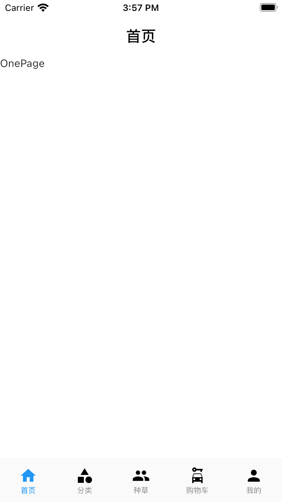​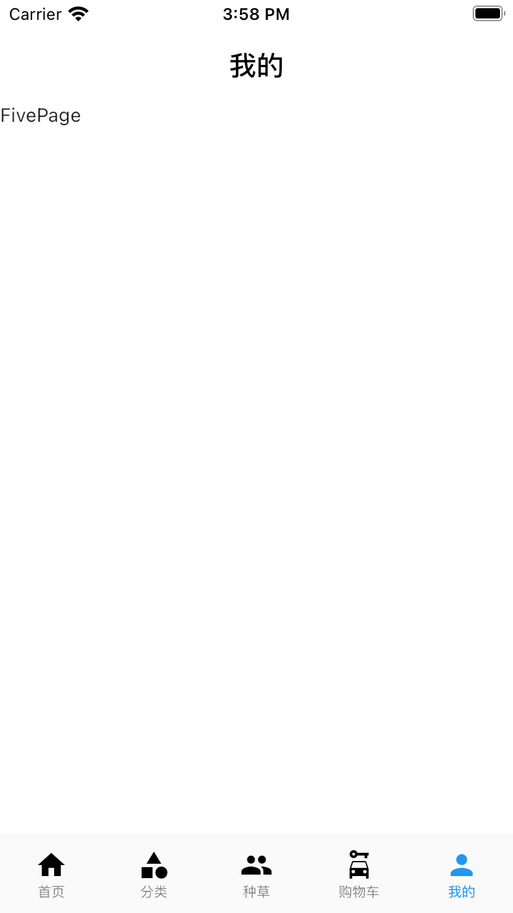​​

# 引入阿里 iconfont 图标

在 iconfont 选择图标下载

iconfont 网址：[https://www.iconfont.cn/](https://www.iconfont.cn/)

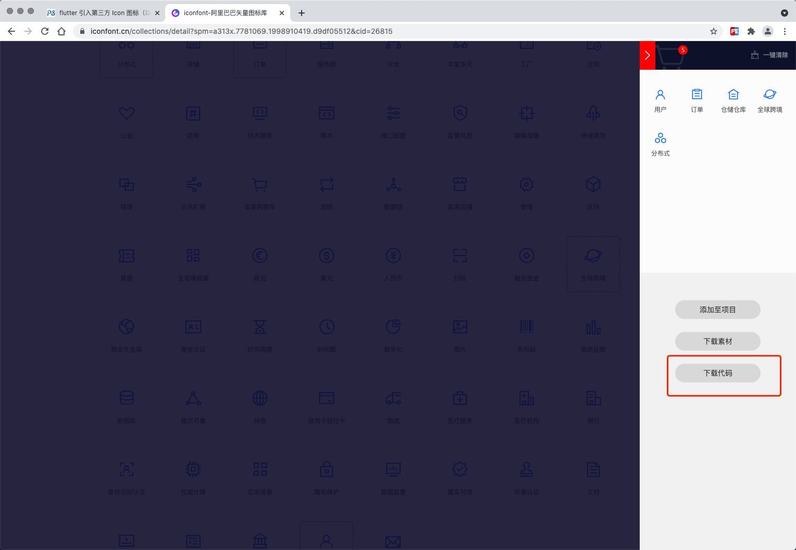​​

解压下载文件

将文件中的 **iconfont.ttf** 文件复制到工程目录下 `lib/assets/icons/`​,如果没有则新建

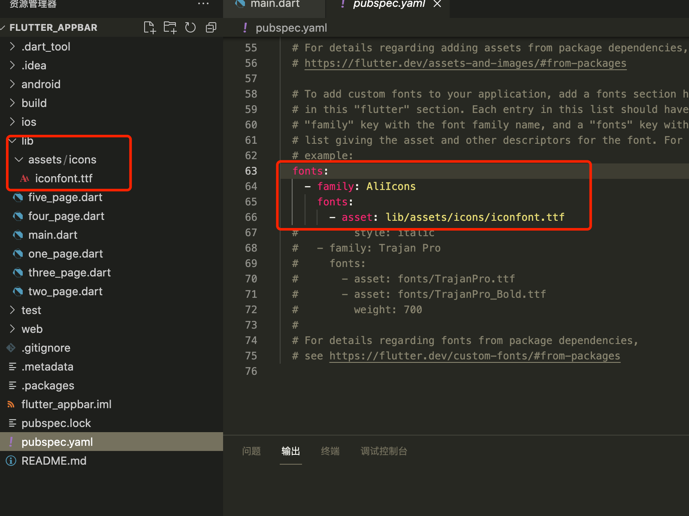​​

修改上节代码

```dart
// tabbar list label
List bottomBarConfigs = [
  {"icon": IconData(0xe98c, fontFamily: 'AliIcons'), "label": '首页'},
  {"icon": IconData(0xe98d, fontFamily: 'AliIcons'), "label": '分类'},
  {"icon": IconData(0xe995, fontFamily: 'AliIcons'), "label": '种草'},
  {"icon": IconData(0xe98e, fontFamily: 'AliIcons'), "label": '购物车'},
  {"icon": IconData(0xe99e, fontFamily: 'AliIcons'), "label": '我的'}
];
```

运行看结果

 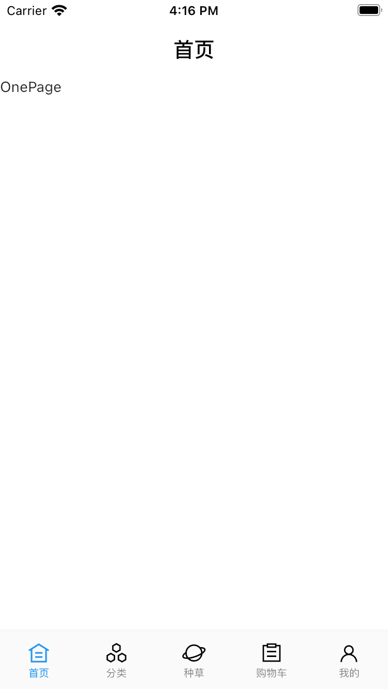   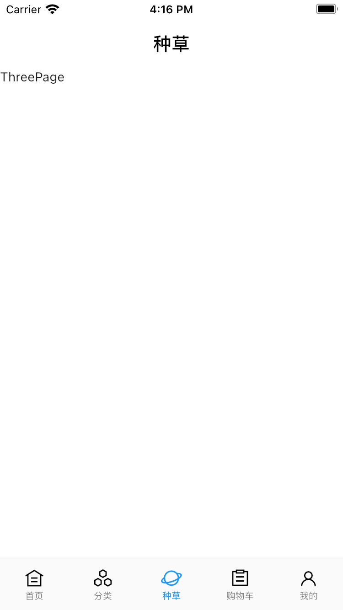​

# 轮播图实现

引入 plugin

```yaml
dependencies:
  flutter:
    sdk: flutter
  flutter_swiper_null_safety: ^1.0.2  # 支持空安全的轮播图插件 https://github.com/best-flutter/flutter_swiper
```

TwoPage 增加代码

```dart
import 'package:flutter/material.dart';
import 'package:flutter_swiper_null_safety/flutter_swiper_null_safety.dart';

class TwoPage extends StatefulWidget {
  const TwoPage({Key? key}) : super(key: key);

  @override
  _TwoPageState createState() => _TwoPageState();
}

class _TwoPageState extends State<TwoPage> {
  // 轮播图url
  List _imgUrlList = [
    'https://scrambleweb.jp/image_manager/article/166833_14d0085850c48ff0f3a5b43be8d77f6d.JPG',
    'https://scrambleweb.jp/image_manager/article/142393_2406fd38373143a14a56d1132fbaa168.JPG',
    'https://img0.baidu.com/it/u=569925027,4189508440&fm=26&fmt=auto&gp=0.jpg'
  ];

  @override
  Widget build(BuildContext context) {
    return Scaffold(
      backgroundColor: Colors.white,
      body: _buildSwiper(),
    );
  }

  /// 轮播图
  Container _buildSwiper() {
    return Container(
      height: 160,
      width: double.infinity,
      child: Swiper(
        itemCount: _imgUrlList.length,
        autoplay: true,
        itemBuilder: (context, index) {
          return Image.network(
            _imgUrlList[index],
            fit: BoxFit.fill,
          );
        },
        // scrollDirection: Axis.vertical, // 设置轮播方向
        pagination: SwiperPagination(),
      ),
    );
  }
}
```

轮播图运行效果

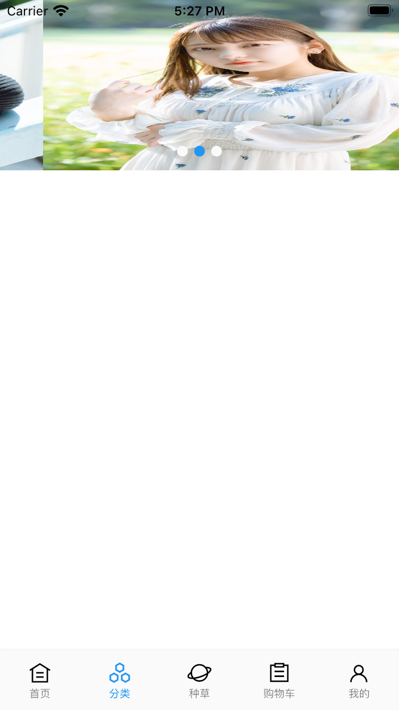​

轮播插件具体属性

|参数|默认值|描述|
| ---------------| ------------------------------| ------------------------------------------------|
|scrollDirection|Axis.horizontal|滚动方向，设置为 Axis.vertical 如果需要垂直滚动|
|loop|true|无限轮播模式开关|
|index|0|初始的时候下标位置|
|autoplay|false|自动播放开关.|
|onIndexChanged|void onIndexChanged(int index)|当用户手动拖拽或者自动播放引起下标改变的时候调用|
|onTap|void onTap(int index)|当用户点击某个轮播的时候调用|
|duration|300.0|动画时间，单位是毫秒|
|pagination|null|设置 `new SwiperPagination()`​ 展示默认分页指示器|
|control|null|设置 `new SwiperControl()`​ 展示默认分页按钮|

分页指示器

分页指示器继承自 `SwiperPlugin`​,`SwiperPlugin`​ 为 `Swiper`​ 提供额外的界面.设置为 `new SwiperPagination()`​ 展示默认分页.

|参数|默认值|描述|
| ---------| --------------------------| --------------------------------------------------------------------------|
|alignment|Alignment.bottomCenter|如果要将分页指示器放到其他位置，那么可以修改这个参数|
|margin|const EdgeInsets.all(10.0)|分页指示器与容器边框的距离|
|builder|SwiperPagination.dots|目前已经定义了两个默认的分页指示器样式： `SwiperPagination.dots`​ 、 `SwiperPagination.fraction`​，都可以做进一步的自定义.|

# 实现渐变头部

增加部分代码让页面可滚动

```dart
@override
Widget build(BuildContext context) {
  return Scaffold(
    backgroundColor: Colors.white,
    body: ListView( // 使用ListView组建让整个组建支持滚动，不出现超出区域错误
      children: [
        // 轮播图
        _buildSwiper(),
        // 设置高度600，撑开页面
        SizedBox(
          height: 600,
        )
      ],
    ),
  );
}
```

去除顶部空白

此时运行，会发现头部有空白区域填充，这是因为 flutter 设计的时候默认针对 ListView 组建有 padding 操作，即状态栏等高度，可以通过 MediaQuery 去除顶部高度

```dart
@override
Widget build(BuildContext context) {
  return Scaffold(
    backgroundColor: Colors.white,
    body: MediaQuery.removePadding(
      context: context,
      removeTop: true,
      child: ListView(
        children: [
          // 轮播图
          _buildSwiper(),
          // 内容区域
          SizedBox(
            height: 600,
          )
        ],
      ),
    ),
  );
}
```

使用 Stack 布局

使用 Stack 组建布局，同时抽取下内容区域布局 code

**Stack 布局：下面的组建会出现在上层**

```dart
@override
Widget build(BuildContext context) {
  return Scaffold(
    backgroundColor: Colors.white,
    body: Stack(
      children: [
        // 内容区域
        _buildContent(context),
      ],
    ),
  );
}

MediaQuery _buildContent(BuildContext context) {
  return MediaQuery.removePadding(
    context: context,
    removeTop: true,
    child: ListView(
      children: [
        // 轮播图
        _buildSwiper(),
        // 内容区域
        SizedBox(
          height: 600,
        )
      ],
    ),
  );
}
```

新增 Opacity 组件包裹 AppBar

```dart
 // 顶部AppBar区域透明度
double _appBarOpacity = 0;

@override
Widget build(BuildContext context) {
  return Scaffold(
    backgroundColor: Colors.white,
    body: Stack(
      children: [
        // 内容区域
        _buildContent(context),
        // 透明appbar
        Opacity(
          opacity: _appBarOpacity,
          child: Container(
            height: kToolbarHeight,
            child: AppBar(
              backgroundColor: Colors.white,
              elevation: 0, // 去除阴影
              title: Text(
                "这是TwoPage",
                style: TextStyle(
                  color: Colors.black,
                  fontSize: 14,
                ),
              ),
            ),
          ),
        ),
      ],
    ),
  );
}
```

监听 NotificationListener

```dart
MediaQuery _buildContent(BuildContext context) {
  return MediaQuery.removePadding(
    context: context,
    removeTop: true,
    child: NotificationListener(
      onNotification: (scrolleNotification) {
        if (scrolleNotification is ScrollUpdateNotification &&
            scrolleNotification.depth == 0) {
          _onScroll(scrolleNotification.metrics.pixels);
        }
        return true;
      },
      child: ListView(
        children: [
          // 轮播图
          _buildSwiper(),
          // 内容区域
          SizedBox(
            height: 600,
          )
        ],
      ),
    ),
  );
}

void _onScroll(offset) {

}
```

定义最大滚动距离

```dart
// 顶部AppBar区域透明度
double _appBarOpacity = 0;
// 定义最大滚动距离
int MAX_SCROLL_DISTANCE = 100;
```

处理滚动监听变化透明度

```dart
void _onScroll(offset) {
  double alpha = offset / MAX_SCROLL_DISTANCE;
  // 兜底处理
  if (alpha < 0) {
    alpha = 0;
  } else if (alpha > 1) {
    alpha = 1;
  }
  setState(() {
    _appBarOpacity = alpha;
  });
}
```

至此滚动渐变 appbar 实现，完整代码

```dart
import 'package:flutter/material.dart';
import 'package:flutter_swiper_null_safety/flutter_swiper_null_safety.dart';

class TwoPage extends StatefulWidget {
  const TwoPage({Key? key}) : super(key: key);

  @override
  _TwoPageState createState() => _TwoPageState();
}

class _TwoPageState extends State<TwoPage> {
  // 轮播图url
  List _imgUrlList = [
    'https://scrambleweb.jp/image_manager/article/166833_14d0085850c48ff0f3a5b43be8d77f6d.JPG',
    'https://scrambleweb.jp/image_manager/article/142393_2406fd38373143a14a56d1132fbaa168.JPG',
    'https://img0.baidu.com/it/u=569925027,4189508440&fm=26&fmt=auto&gp=0.jpg'
  ];
  // 顶部AppBar区域透明度
  double _appBarOpacity = 0;
  // 定义最大滚动距离
  int MAX_SCROLL_DISTANCE = 100;

  @override
  Widget build(BuildContext context) {
    return Scaffold(
      backgroundColor: Colors.white,
      body: Stack(
        children: [
          // 内容区域
          _buildContent(context),
          // 透明appbar
          Opacity(
            opacity: _appBarOpacity,
            child: Container(
              height: kToolbarHeight,
              child: AppBar(
                backgroundColor: Colors.white,
                elevation: 0, // 去除阴影
                title: Text(
                  "这是TwoPage",
                  style: TextStyle(
                    color: Colors.black,
                    fontSize: 14,
                  ),
                ),
              ),
            ),
          ),
        ],
      ),
    );
  }

  MediaQuery _buildContent(BuildContext context) {
    return MediaQuery.removePadding(
      context: context,
      removeTop: true,
      child: NotificationListener(
        onNotification: (scrolleNotification) {
          if (scrolleNotification is ScrollUpdateNotification &&
              scrolleNotification.depth == 0) {
            _onScroll(scrolleNotification.metrics.pixels);
          }
          return true;
        },
        child: ListView(
          children: [
            // 轮播图
            _buildSwiper(),
            // 内容区域
            SizedBox(
              height: 600,
            )
          ],
        ),
      ),
    );
  }

  void _onScroll(offset) {
    double alpha = offset / MAX_SCROLL_DISTANCE;
    // 兜底处理
    if (alpha < 0) {
      alpha = 0;
    } else if (alpha > 1) {
      alpha = 1;
    }
    setState(() {
      _appBarOpacity = alpha;
    });
  }

  /// 轮播图
  Container _buildSwiper() {
    return Container(
      height: 160,
      width: double.infinity,
      child: Swiper(
        itemCount: _imgUrlList.length,
        autoplay: true,
        itemBuilder: (context, index) {
          return Image.network(
            _imgUrlList[index],
            fit: BoxFit.fill,
          );
        },
        // scrollDirection: Axis.vertical,
        pagination: SwiperPagination(
            // alignment: Alignment.centerRight,
            // builder: SwiperPagination.dots,
            ),
      ),
    );
  }
}
```

渐变 AppBar 运行效果

如果视频无法播放，右击鼠标 》显示控件，点击播放

<video controls="controls" 
  src="./assets/9-20231002010643-76wzp6l.mov" 
  data-src="/计算机时代/Flutter冲/assets/9-20231002010643-76wzp6l.mov">
</video>

# 代码生成 Model

导入依赖

在 `dev_dependencies` ​标签下增加 **json_serializable** 和 **build_runner** 依赖

```yaml
dev_dependencies:
  flutter_test:
    sdk: flutter
  json_serializable: ^4.1.0
  build_runner: ^2.0.0
```

根据 json 生成通用实体

 打开网址：[https://caijinglong.github.io/json2dart/index.html](https://caijinglong.github.io/json2dart/index.html)

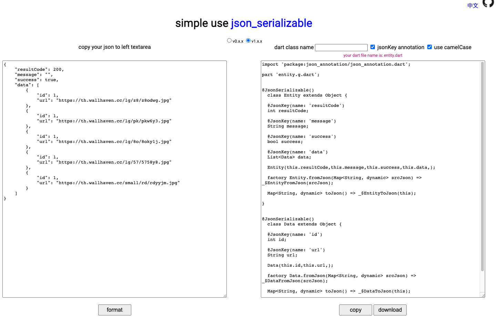​

执行命令生成.g 文件

将上述生成的 model 文件拷贝到工程目录，新建 dart 文件保存，此时报错不用处理，进入项目根目录，执行如下命令

```shell
flutter packages pub run build_runner build
```

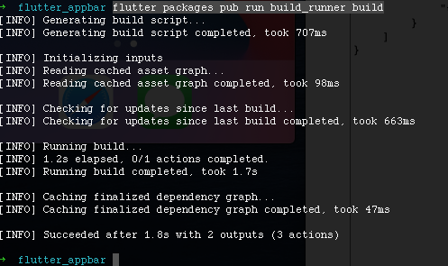​​​

使用如下命令监视项目文件改动

```shell
flutter packages pub run build_runner watch
```

如果无法生成，使用如下命令删除

```shell
flutter packages pub run build_runner build --delete-conflicting-outputs
```

ThreePage 页面代码使用实例

`banner_entity.dart`​

```dart
import 'package:json_annotation/json_annotation.dart';

part 'banner_entity.g.dart';

@JsonSerializable()
class BannerEntity extends Object {
  @JsonKey(name: 'resultCode')
  int resultCode;

  @JsonKey(name: 'message')
  String message;

  @JsonKey(name: 'success')
  bool success;

  @JsonKey(name: 'data')
  List<Data> data;

  BannerEntity(
    this.resultCode,
    this.message,
    this.success,
    this.data,
  );

  factory BannerEntity.fromJson(Map<String, dynamic> srcJson) =>
      _$BannerEntityFromJson(srcJson);

  Map<String, dynamic> toJson() => _$BannerEntityToJson(this);
}

@JsonSerializable()
class Data extends Object {
  @JsonKey(name: 'id')
  int id;

  @JsonKey(name: 'url')
  String url;

  Data(
    this.id,
    this.url,
  );

  factory Data.fromJson(Map<String, dynamic> srcJson) =>
      _$DataFromJson(srcJson);

  Map<String, dynamic> toJson() => _$DataToJson(this);
}
```

`banner_entity.g.dart`​

```dart
// GENERATED CODE - DO NOT MODIFY BY HAND

part of 'banner_entity.dart';

// **************************************************************************
// JsonSerializableGenerator
// **************************************************************************

BannerEntity _$BannerEntityFromJson(Map<String, dynamic> json) {
  return BannerEntity(
    json['resultCode'] as int,
    json['message'] as String,
    json['success'] as bool,
    (json['data'] as List<dynamic>)
        .map((e) => Data.fromJson(e as Map<String, dynamic>))
        .toList(),
  );
}

Map<String, dynamic> _$BannerEntityToJson(BannerEntity instance) =>
    <String, dynamic>{
      'resultCode': instance.resultCode,
      'message': instance.message,
      'success': instance.success,
      'data': instance.data,
    };

Data _$DataFromJson(Map<String, dynamic> json) {
  return Data(
    json['id'] as int,
    json['url'] as String,
  );
}

Map<String, dynamic> _$DataToJson(Data instance) => <String, dynamic>{
      'id': instance.id,
      'url': instance.url,
    };
```

`three_page.dart`​

```dart
import 'dart:convert';

import 'package:flutter/material.dart';
import 'package:flutter_appbar/model/banner_entity.dart';
import 'package:flutter_appbar/model/resp_dto.dart';
import 'package:http/http.dart' as http;

class ThreePage extends StatefulWidget {
  const ThreePage({Key? key}) : super(key: key);

  @override
  _ThreePageState createState() => _ThreePageState();
}

class _ThreePageState extends State<ThreePage> {
  @override
  void initState() {
    super.initState();
    fetchBannerList();
  }

  @override
  Widget build(BuildContext context) {
    return Scaffold(
      appBar: AppBar(
        backgroundColor: Colors.white,
        elevation: 0,
        title: Container(
          width: double.infinity,
          height: 30,
          padding: EdgeInsets.only(left: 10),
          decoration: BoxDecoration(
            borderRadius: BorderRadius.circular(6),
            color: Colors.grey[200],
          ),
          child: Row(
            // mainAxisAlignment: MainAxisAlignment.center,
            children: [
              Icon(
                Icons.search,
                color: Colors.black38,
                size: 18,
              ),
              Text(
                "搜索图片",
                style: TextStyle(
                  color: Colors.black38,
                  fontSize: 12,
                ),
              ),
            ],
          ),
        ),
      ),
      body: FutureBuilder<BannerEntity>(
        builder: (BuildContext context, AsyncSnapshot<BannerEntity> snapshot) {
          switch (snapshot.connectionState) {
            case ConnectionState.none:
              return new Text("Input a URL to start");
            case ConnectionState.waiting:
              return Center(child: CircularProgressIndicator());
            case ConnectionState.active: //
              break;
            case ConnectionState.done:
              if (snapshot.hasError || snapshot.data!.resultCode != 200) {
                return new Text(
                  '${snapshot.hasError}',
                  style: TextStyle(
                    color: Colors.red,
                  ),
                );
              }
              List<Data> bannerList = snapshot.data!.data;
              // print(bannerList);
              return ListView(
                children: bannerList.map((e) => _buildContent(e.url)).toList(),
              );
          }
          return new Text(snapshot.connectionState.toString());
        },
        future: fetchBannerList(),
      ),
    );
  }

  Widget _buildContent(url) {
    return Container(
      // alignment: Alignment.center,
      width: double.infinity,
      height: 120,
      child: Container(
        padding: EdgeInsets.all(8),
        clipBehavior: Clip.hardEdge,
        decoration: BoxDecoration(
          borderRadius: BorderRadius.circular(10),
        ),
        width: double.infinity,
        height: 120,
        child: Image.network(
          url,
          fit: BoxFit.fill,
        ),
      ),
    );
  }

  Future<BannerEntity> fetchBannerList() async {
    final response = await http.get(
      Uri.parse("http://rap2api.taobao.org/app/mock/284270/bannerList"),
    );
    Utf8Decoder utf8decoder = new Utf8Decoder();
    var result = json.decode(utf8decoder.convert(response.bodyBytes));
    // return RespDTO.fromJson(result);
    return BannerEntity.fromJson(result);
  }
}
```

运行效果

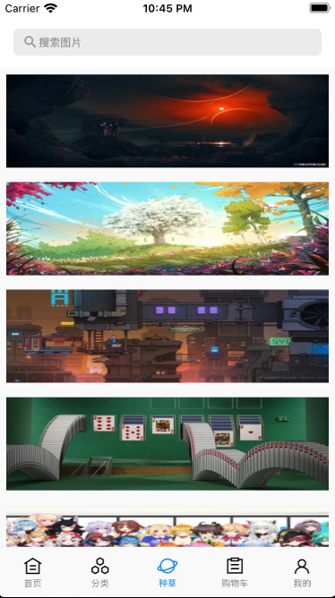​​

代码结构图

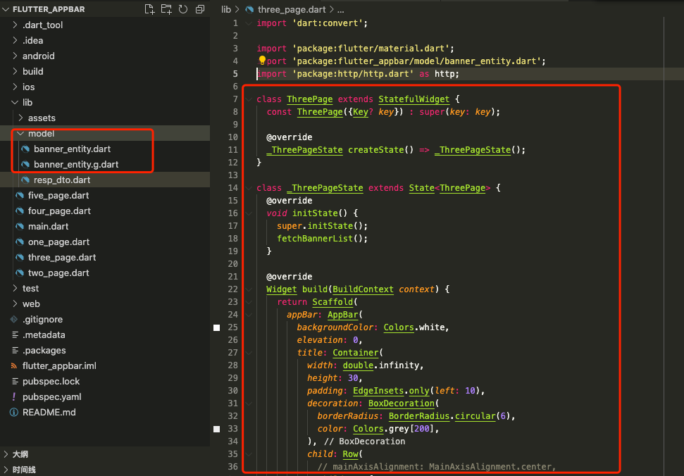​​

# 处理 Android 异形屏启动状态栏无法全屏问题

1.修改 `ftab\android\app\src\main\res\values\styles.xml` ​内容

修改前内容

```xml
<style name="LaunchTheme" parent="@android:style/Theme.Black.NoTitleBar">
    <!-- Show a splash screen on the activity. Automatically removed when
            Flutter draws its first frame -->
    <item name="android:windowBackground">@drawable/launch_background</item>
</style>
```

修改后内容

```xml
<style name="LaunchTheme" parent="@android:style/Theme.Black.NoTitleBar">
    <!-- Show a splash screen on the activity. Automatically removed when
         Flutter draws its first frame -->
    <item name="android:windowBackground">@drawable/launch_background</item>
    <item name="android:windowFullscreen">true</item>
    <item name="android:windowLayoutInDisplayCutoutMode">shortEdges</item>
</style>
```

2.修改内容

修改前内容

```java
package com.example.ftab;

import io.flutter.embedding.android.FlutterActivity;

public class MainActivity extends FlutterActivity {
}
```

修改后内容

```java
package com.example.ftab;

import androidx.annotation.NonNull;
import io.flutter.embedding.android.FlutterActivity;
import io.flutter.embedding.engine.FlutterEngine;
import io.flutter.plugins.GeneratedPluginRegistrant;
 
// 引入
import android.os.Build;
import android.os.Bundle;
 
public class MainActivity extends FlutterActivity {
  @Override
  public void configureFlutterEngine(@NonNull FlutterEngine flutterEngine) {
    GeneratedPluginRegistrant.registerWith(flutterEngine);
  }
 
  // 设置状态栏沉浸式透明（修改flutter状态栏黑色半透明为全透明）
  @Override
  protected void onCreate(Bundle savedInstanceState) {
    super.onCreate(savedInstanceState);
    if (Build.VERSION.SDK_INT >= Build.VERSION_CODES.LOLLIPOP) {
      getWindow().setStatusBarColor(0);
    }
  }
}
```

可以重启看效果，就发现启动就是全屏启动了 配合如下内容就可以全屏无黑色状态栏了

```dart
if (Platform.isAndroid) {
    // 如果是Android，则设置状态栏透明
    SystemUiOverlayStyle systemUiOverlayStyle =
        SystemUiOverlayStyle(statusBarColor: Colors.transparent);
    SystemChrome.setSystemUIOverlayStyle(systemUiOverlayStyle);
}
```

# 页面状态保存处理

假设在其他页面切回 `home_page.dart` ​时需要保存页面数据(滚动位置等)，修改内容如下

```dart
import 'package:flutter/material.dart';

class HomePage extends StatefulWidget {
  @override
  _HomePageState createState() => _HomePageState();
}

class _HomePageState extends State<HomePage>
    with AutomaticKeepAliveClientMixin {
  @override
  Widget build(BuildContext context) {
    return Container(
      child: Text('Home'),
    );
  }

  @override
  bool get wantKeepAlive => true;
}
```

通过混入 `AutomaticKeepAliveClientMixin` ​实现 `wantKeepAlive` ​函数，按条件返回 `true`​。 从而保存 `home_page.dart` ​页面状态

‍
