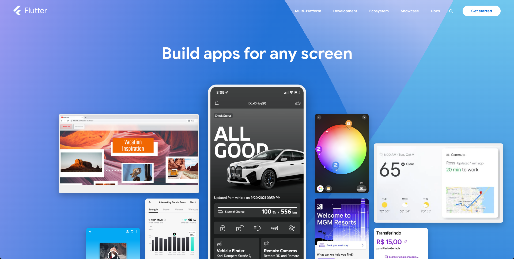

# Flutter冲

# 三方库

> [https://pub.dev/](https://pub.dev/)

	

# 源起

想开发一个跨平台并且过的去的APP, 调研过React Native、Uniapp一类的语言感觉都差强人意.

曾经也想学学Android和iOS开发. 结果发现经历不足. 而且两个语言又分出来太多东西了. 比如Android又分为Java和Kotlin. 后续好像还有啥Jetpack框架??? iOS要么学习Object-C, 要么学习Swift. 个人比较倾向于Swift的后台逻辑, 然后使用UIKit那套实现界面. 但是官方推荐SwiftUI...

针对SwiftUI那一套声明式无感... 

所以最终选择Flutter. 过得去的性能. 过得去的体验. 反正啥都过得去.

**tips:****​ 结果发现没有插件需要自己实现, 还是要学习Android和iOS, 索性插件市场也较为活跃. 所以还能接受.**

‍
