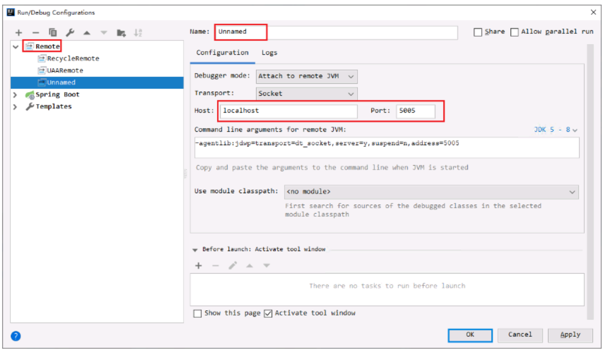

# #IDEA远程调试

# 远程调试

服务端：设置如下参数，支持远程调试

```shell
JAVA_OPTS="-Xrunjdwp:transport=dt_socket,address=0.0.0.0:8000,suspend=n,server=y"
```

etc. 使用docker启动的服务，则类似

```shell
# 映射要调试的端口
-p 9000:9000
# 配置支持远程调试
-e JAVA_OPTS='-Xrunjdwp:transport=dt_socket,address=0.0.0.0:9000,suspend=n,server=y'
```

然后启动服务，检测端口联通性

客户端可以使用熟悉的开发工具，这里以IDEA为例.

​​

配置完之后启动监听，然后运行对应的功能，即可断点调试。
