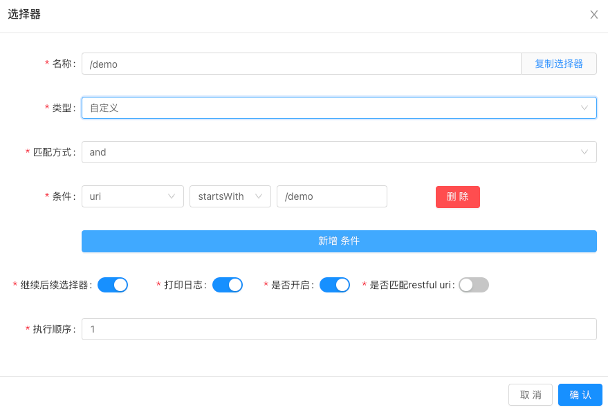

# #ShenYu网关解析

> 核心配置类：org.apache.shenyu.springboot.starter.gateway.ShenyuConfiguration

#### ShenyuTrieListener(二级缓存)

```java
@Bean(name = "shenyuSelectorTrie")
public ShenyuTrie shenyuSelectorTrie(final ShenyuConfig shenyuConfig) {
  SelectorMatchCache selectorMatchCache = shenyuConfig.getSelectorMatchCache();
  return new ShenyuTrie(selectorMatchCache.getTrie().getCacheSize(),selectorMatchCache.getTrie()
                        .getMatchMode());
}


@Bean(name = "shenyuRuleTrie")
public ShenyuTrie shenyuRuleTrie(final ShenyuConfig shenyuConfig) {
    RuleMatchCache ruleMatchCache = shenyuConfig.getRuleMatchCache();
    return new ShenyuTrie(ruleMatchCache.getTrie().getCacheSize(),ruleMatchCache.getTrie()
                          .getMatchMode());
}

@Bean
public ShenyuTrieListener shenyuTrieListener() {
    return new ShenyuTrieListener();
}
```

这个监听器做什么的？

这是Shenyu规则监听器。当admin管理端修改了规则，会触发TrieEvent事件，利用SpringApplicationEvent事件监听触发Listener。然后进行规则修改。数据源主要分为：selector和rule。

当监听到TrieEvent事件，根据type获取不同的Bean(shenyuSelectorTrie/shenyuRuleTrie)。然后判断insert/update/remove调用bean对应的方法同步加锁synchronized(Object)处理，从而实现内存中的规则更新。

#### ShenyuConfig

```java
@Bean
@ConfigurationProperties(prefix = "shenyu")
public ShenyuConfig shenyuConfig() {
    return new ShenyuConfig();
}
```

```java
public class ShenyuConfig {
  // local = true, collapseSlashes = true
  private SwitchConfig switchConfig = new SwitchConfig();
  
	// enabled, maxSize = 10 (上传文件默认最大10MB)
  private FileConfig file = new FileConfig();
  
	// enabled, paths = new ArrayList()
  private ExcludePath exclude = new ExcludePath();
  
	// enabled, paths = new ArrayList()
  private Health health = new Health();
  
	// enabled, paths = new ArrayList()
  private FallbackPath fallback = new FallbackPath();
  
	// enabled, path, threads - 1, scheduleTime = 300, scheduleDelay = 30
  private ExtPlugin extPlugin = new ExtPlugin();
  
	// enabled, type = "fixed"
  // threads = Math.max((Runtime.getRuntime().availableProcessors() << 1) + 1, 16)
  private Scheduler scheduler = new Scheduler();
  
	// enabled
  // poolSize = 10
  // timeout = 3000
  // healthyThreshold = 1
  // unhealthyThreshold = 1
  // interval = 5000
  // printEnabled
  // prinInterval = 60000
  private UpstreamCheck upstreamCheck = new UpstreamCheck();
  
  // enabled
  // allowedHeaders
  // allowedMethods = "*"
  // allowedOrigin
	// 		spacer = "."
  // 		domain
  // 		prefixes = set()
  // 		origins
  // 		originRegex
 	// allowedAnyOrigin
  // allowedExpose = ""
  // maxAge = "18000"
  // allowCredentials
  private CrossFilterConfig cross = new CrossFilterConfig();
  
	// serverListRefreshInterval = 10000
  private RibbonConfig ribbon = new RibbonConfig();
  
	// enabled, sha512Key
  private Local local = new Local();
  
	// maxFramePayloadSize = 10
  private WebsocketConfig websocket = new WebsocketConfig();
  
  // enabled = false
  // prefix = "shenyu-shared"
  // corePoolSize = 200
  // maximumPoolSize = Integer.MAX_VALUE
  // keepAliveTime = 60000L
  // maxWorkQueueMemory = MemoryLimitCalculator.defaultLimit()
  // maxFreeMemory
  private SharedPool sharedPool = new SharedPool();
  
  // enabled, name, host, port, jmxConfig, props
  private MetricsConfig metrics = new MetricsConfig();
  
	// cache: MatchCacheConfig(一级缓存)
  // 		enabled = true, initialCapacity = 10000, maximumSize = 10000L
  // trie: ShenyuTrieConfig(二级缓存)
  // 		enabled = false, cacheSize = 512L, matchMode = antPathMatch
  private SelectorMatchCache selectorMatchCache = new SelectorMatchCache();
  
  // cache: MatchCacheConfig(一级缓存)
  // 		enabled = true, initialCapacity = 10000, maximumSize = 10000L
  // trie: ShenyuTrieConfig(二级缓存)
  // 		enabled = false, cacheSize = 512L, matchMode = antPathMatch
  private RuleMatchCache ruleMatchCache = new RuleMatchCache();

  // enabled
  private SpringCloudCacheConfig springCloudCache = new SpringCloudCacheConfig();
}
```

#### AbstractWebFilter

> XXXFilter extends AbstractWebFilter implements WebFilter

AbstractWebFilter做了什么操作？

```java
@Override
@NonNull
public Mono<Void> filter(@NonNull final ServerWebExchange exchange, @NonNull final WebFilterChain chain) {
    return doMatcher(exchange, chain)
      					.flatMap(result -> result 
                         ? doFilter(exchange) 
                         : chain.filter(exchange)
             						);
}
```

调用**doMatch**方法，根据**doMatch**方法返回，判断**doFilter**过滤还是，直接**chain.filter**放行请求。

**doMatch**是抽象方法，由XXXFilter实现；**doFilter**也是抽象方法，由XXXFilter实现。

#### CollapseSlashesFilter

##### 分析

```java
@Bean
@Order(-300)
@ConditionalOnProperty(value = "shenyu.switchConfig.collapseSlashes", havingValue = "true")
public WebFilter collapseSlashesFilter() {
    return new CollapseSlashesFilter();
}
```

这个是做什么？

从名字上看：合并斜杠过滤器，当请求地址中存在多斜杠，则合并，规范化请求地址。

假设原始请求地址是`/example//path/to/resource`​，这个地址包含了连续的两个斜杠。应用上述代码后，经过路径规范化处理后的地址会变为`/example/path/to/resource`​。这样，代码就成功地处理了多个连续斜杠的情况。

开关：shenyu.switchConfig.collapseSlashes，默认是开启的。

#### LocalDispatcherFilter

##### 分析

```java
@Bean
@Order(-200)
@ConditionalOnProperty(name = "shenyu.local.enabled", havingValue = "true", matchIfMissing = true)
public WebFilter localDispatcherFilter(final DispatcherHandler dispatcherHandler, final ShenyuConfig shenyuConfig) {
    return new LocalDispatcherFilter(dispatcherHandler, shenyuConfig.getLocal().getSha512Key());
}
```

这个Filter主要实现什么功能？

```java
public class LocalDispatcherFilter extends AbstractWebFilter {
  
    private static final String DISPATCHER_PATH = "/shenyu/";

    private final DispatcherHandler dispatcherHandler;
  
    private final String sha512Key;
    public LocalDispatcherFilter(final DispatcherHandler dispatcherHandler, final String sha512Key) {
        this.dispatcherHandler = dispatcherHandler;
        this.sha512Key = sha512Key;
    }
  
    @Override
    protected Mono<Boolean> doMatcher(final ServerWebExchange exchange, final WebFilterChain chain) {
        return Mono.just(exchange.getRequest().getURI().getPath().startsWith(DISPATCHER_PATH));
    }
  
    @Override
    protected Mono<Void> doFilter(final ServerWebExchange exchange) {
        String localKey = exchange.getRequest().getHeaders().getFirst(Constants.LOCAL_KEY);
        if (Objects.isNull(sha512Key) || !sha512Key.equalsIgnoreCase(DigestUtils.sha512Hex(localKey)) || Objects.isNull(localKey)) {
            return Mono.error(new ResponseStatusException(HttpStatus.FORBIDDEN, "The key is not correct."));
        }
        return dispatcherHandler.handle(exchange);
    }
}
```

##### 流程分析

如果请求是"/shenyu/"开头，则会从请求头中获取key=localKey的value进行sha512计算和配置的key进行对比。如果一致则继续请求，否则则响应403禁止访问。

开关：shenyu.local.enabled，默认是开。

#### CrossFilter

##### 分析

```java
@Bean
@Order(-100)
@ConditionalOnProperty(name = "shenyu.cross.enabled", havingValue = "true")
public WebFilter crossFilter(final ShenyuConfig shenyuConfig) {
    return new CrossFilter(shenyuConfig.getCross());
}
```

这个就是跨域处理，没啥特别的。

#### FileSizeFilter

```java
@Bean
@Order(-10)
@ConditionalOnProperty(name = "shenyu.file.enabled", havingValue = "true")
public WebFilter fileSizeFilter(final ShenyuConfig shenyuConfig) {
    return new FileSizeFilter(shenyuConfig.getFile().getMaxSize());
}
```

这个是控制上传文件大小的，默认10MB

更改设置：shenyu.file.maxSize = N， 单位MB

#### ExcludeFilter

```java
@Bean
@Order(-5)
@ConditionalOnProperty(name = "shenyu.exclude.enabled", havingValue = "true")
public WebFilter excludeFilter(final ShenyuConfig shenyuConfig) {
    return new ExcludeFilter(shenyuConfig.getExclude().getPaths());
}
```

请求排除，如果配置了相关请求并且匹配，则直接返回成功。不做处理。

##### FallbackFilter

```java
@Bean
@Order(-5)
@ConditionalOnProperty(name = "shenyu.fallback.enabled", havingValue = "true")
public WebFilter fallbackFilter(final ShenyuConfig shenyuConfig, final DispatcherHandler dispatcherHandler) {
    return new FallbackFilter(shenyuConfig.getFallback().getPaths(), dispatcherHandler);
}
```

这个Filter是做什么的？

这个是请求回退。当配置paths包含请求，则执行响应fallback请求。类似熔断？？？

#### HealthFilter

##### 分析

```java
@Bean
@Order(-99)
@ConditionalOnProperty(name = "shenyu.health.enabled", havingValue = "true")
public WebFilter healthFilter(final DispatcherHandler dispatcherHandler, final ShenyuConfig shenyuConfig) {
    return new HealthFilter(dispatcherHandler, shenyuConfig.getHealth().getPaths());
}
```

这个Bean是做什么的？

根据配置文件: shenyu.health.enabled是否为true进行条件注入ShenyuConfiguration中的Health我们可以看出默认是false，也就是不注入的。假设为true，后续会发生什么呢？

```java
public final class HealthFilter extends AbstractWebFilter {
  
    private final DispatcherHandler dispatcherHandler;
  
    private final Set<String> paths;
  
    public HealthFilter(final DispatcherHandler dispatcherHandler, final List<String> paths) {
        this.dispatcherHandler = dispatcherHandler;
        if (CollectionUtils.isEmpty(paths)) {
            this.paths = new HashSet<>(Arrays.asList("/actuator", "/health_check"));
        } else {
            this.paths = new HashSet<>(paths); 
        }
    }
  
    @Override
    protected Mono<Boolean> doMatcher(final ServerWebExchange exchange, final WebFilterChain chain) {
        return Mono.just(paths.stream()
                         .anyMatch(path -> exchange.getRequest()
                                   							 .getURI()
                                                 .getPath()
                                   							 .startsWith(path)
                                  )
                        );
    }
  
    @Override
    protected Mono<Void> doFilter(final ServerWebExchange exchange) {
        return dispatcherHandler.handle(exchange);
    }
}
```

dispatchHandler哪里来的？

SpringMVC框架中核心类，用于请求分发。在配置类中同样存在注入的code。

```java
@Bean("dispatcherHandler")
public DispatcherHandler dispatcherHandler() {
    return new DispatcherHandler();
}
```

dispatchHandler有了，paths呢？这个是从配置文件获取的。`shenyuConfig.getHealth().getPaths()`​ shenyuConfig即上面的ShenyuConfig对象。配置文件皆以`shenyu`​开头!

##### 流程描述

当服务启动，如果 shenyu.health.enabled=true注入HealthFilter。

当请求进入，根据doMatch判断请求是否和配置的paths相匹配（这里采用了前缀匹配），如果匹配则执行doFilter方法。

TIPS：paths如果不配置，默认请求路径为：/actuator，/health_check

这个请求主要是服务健康检测作用！！！

#### ShenyuWebHandler(核心处理器)

```java
@Bean("webHandler")
public ShenyuWebHandler shenyuWebHandler(final ObjectProvider<List<ShenyuPlugin>> plugins, 
                                         final ShenyuConfig config, 
                                         @Lazy final ShenyuLoaderService shenyuLoaderService) {
    List<ShenyuPlugin> pluginList = plugins.getIfAvailable(Collections::emptyList);
    List<ShenyuPlugin> shenyuPlugins = pluginList.stream()
            .sorted(Comparator.comparingInt(ShenyuPlugin::getOrder))
						.collect(Collectors.toList());
    shenyuPlugins.forEach(shenyuPlugin -> 
                          LOG.info("load plugin:[{}] [{}]", shenyuPlugin.named(),
                                   shenyuPlugin.getClass().getName())
                         );
    return new ShenyuWebHandler(shenyuPlugins, shenyuLoaderService, config);
}
```

##### 分析

这是Shenyu的核心处理插件。

服务启动时，遍历所有插件和loader服务，并且根据类型创建调度器。

##### 流程分析

```java
public final class ShenyuWebHandler implements WebHandler, ApplicationListener<PluginHandlerEvent> {

}
```

类实现了WebHandler接口，所以关注`Mono<Void> handle(ServerWebExchange exchange)`​方法

```java
@Override
public Mono<Void> handle(@NonNull final ServerWebExchange exchange) {
    Mono<Void> execute = new DefaultShenyuPluginChain(plugins).execute(exchange);
    if (scheduled) {
        return execute.subscribeOn(scheduler);
    }
    return execute;
}
```

从上述方法可以看出又筛选了执行链，根据exchange判断是否定时调度，这里其实是责任链模式+reactive响应编程。后续具体分析DefaultShenyuPluginChain及执行。

同时利用Spring监听了PluginHandlerEvent自定义事件。当服务另一处发布该事件，则此类需要处理消费。方法为：

```java
@Override
public void onApplicationEvent(final PluginHandlerEvent event) {
    PluginHandlerEventEnum stateEnums = event.getPluginStateEnums();
    PluginData pluginData = (PluginData) event.getSource();
    switch (stateEnums) {
        case ENABLED:
            onPluginEnabled(pluginData);
            break;
        case DELETE:
        case DISABLED:
            // disable or removed plugin.
            onPluginRemoved(pluginData);
            break;
        case SORTED:
            // copy a new one, or there will be concurrency problems
            this.plugins = sortPlugins(new ArrayList<>(this.plugins));
            break;
        default:
            throw new IllegalStateException("Unexpected value: " + event.getPluginStateEnums());
    }
}
```

根据插件类型，区分开启、关闭、存储。从而执行不同业务逻辑。

```java
private static class DefaultShenyuPluginChain implements ShenyuPluginChain {
    private int index;
    private final List<ShenyuPlugin> plugins;
    DefaultShenyuPluginChain(final List<ShenyuPlugin> plugins) {
        this.plugins = plugins;
    }
    @Override
    public Mono<Void> execute(final ServerWebExchange exchange) {
        return Mono.defer(() -> {
            if (this.index < plugins.size()) {
                ShenyuPlugin plugin = plugins.get(this.index++);
                boolean skip = plugin.skip(exchange);
                if (skip) {
                    return this.execute(exchange);
                }
                return plugin.execute(exchange, this);
            }
            return Mono.empty();
        });
    }
}
```

插件执行链，根据序号排列所有已加载插件信息。然后循环执行，如果插件支持处理，则通过插件处理。如果插件不处理，则skip。

### Plugin Order

#### 核心选择分析

```java
@Override
public Mono<Void> execute(final ServerWebExchange exchange, final ShenyuPluginChain chain) {
  	// 初始化缓存配置; 一级缓存、二级缓存
    initCacheConfig();
  	// 获取插件名称
    final String pluginName = named();
    // 根据插件名，从JVM内存获取插件数据
  	PluginData pluginData = BaseDataCache.getInstance().obtainPluginData(pluginName);
    // early exit 如果没有插件数据，或者插件没打开，则放行。
    if (Objects.isNull(pluginData) || !pluginData.getEnabled()) {
        return chain.execute(exchange);
    }
  	// 获取请求path 
    final String path = exchange.getRequest().getURI().getPath();
  	// 根据插件名称，获取所有Selector数据
    List<SelectorData> selectors = BaseDataCache.getInstance().obtainSelectorData(pluginName);
  	// 如果Selector数据为空，则继续chain执行，放行。
    if (CollectionUtils.isEmpty(selectors)) {
        return handleSelectorIfNull(pluginName, exchange, chain);
    }
  	// 根据路径判断是否开启Selector，如果没开或者没有则放行。
    SelectorData selectorData = obtainSelectorDataCacheIfEnabled(path);
    // handle Selector
    if (Objects.nonNull(selectorData) && StringUtils.isBlank(selectorData.getId())) {
        return handleSelectorIfNull(pluginName, exchange, chain);
    }
 		// 如果Selector数据为空，则通过L2缓存判断；如果L2缓存匹配也是空，则通过L1缓存匹配。
    if (Objects.isNull(selectorData)) {
        selectorData = trieMatchSelector(exchange, pluginName, path);
        if (Objects.isNull(selectorData)) {
            selectorData = defaultMatchSelector(exchange, selectors, path);
            if (Objects.isNull(selectorData)) {
                return handleSelectorIfNull(pluginName, exchange, chain);
            }
        }
    }
  	// 输出日志
    printLog(selectorData, pluginName);
  	// 如果当前选择器是最终选择器，则不继续往下匹配规则。缓存的场景可能不需要继续往下执行了
    // http请求默认会被AbstractHttpClientPlugin插件执行。
    if (!selectorData.getContinued()) {
        // if continued， not match rules
        return doExecute(exchange, chain, selectorData, defaultRuleData(selectorData));
    }
  	// 根据selectorId从JVM内存中获取所有规则数据
    List<RuleData> rules = BaseDataCache.getInstance().obtainRuleData(selectorData.getId());
    if (CollectionUtils.isEmpty(rules)) {
        return handleRuleIfNull(pluginName, exchange, chain);
    }
  	// 如果选择器是选择全流量，则直接执行最后一条匹配规则。因为这里rules已经排好序，所以直接获取最后一条即可。
    if (selectorData.getType() == SelectorTypeEnum.FULL_FLOW.getCode()) {
        //get last
        RuleData rule = rules.get(rules.size() - 1);
        printLog(rule, pluginNamex
        return doExecute(exchange, chain, selectorData, rule);
    }
  	// 如果是自定义，则需要匹配url规则，然后选择对应的rule处理。
    // lru map as L1 cache,the cache is enabled by default.
    // if the L1 cache fails to hit, using L2 cache based on trie cache.
    // if the L2 cache fails to hit, execute default strategy.
    RuleData ruleData = obtainRuleDataCacheIfEnabled(path);
    if (Objects.nonNull(ruleData) && Objects.isNull(ruleData.getId())) {
        return handleRuleIfNull(pluginName, exchange, chain);
    }
    if (Objects.isNull(ruleData)) {
        // L1 cache not exist data, try to get data through trie cache
        ruleData = trieMatchRule(exchange, selectorData, path);
        // trie cache fails to hit, execute default strategy
        if (Objects.isNull(ruleData)) {
            ruleData = defaultMatchRule(exchange, rules, path);
            if (Objects.isNull(ruleData)) {
                return handleRuleIfNull(pluginName, exchange, chain);
            }
        }
    }
    printLog(ruleData, pluginName);
  	// 实际执行具体插件的功能。。。。 多数是往请求上下文中放数据或改数据。
    return doExecute(exchange, chain, selectorData, ruleData);
}
```

#### Selector

​​

如果选择全部流量，则不匹配uri

如果选择自定义流量则匹配uri

#### Rule

#### -1

global

#### 0

> Tcp
>
> mqtt

#### 8

> mock

#### 10

> cache

#### 15

> metrics

#### 20

> sign

#### 30

> jwt

#### 40

> oauth2
>
> casdoor

#### 50

> waf

#### 60

> rateLimiter

#### 70

> paramMapping

#### 80

> contextPath

#### 90

> rewrite

#### 100

> cryptorRequest

#### 110

> redirect

#### 120

> request

#### 125

> generalContext

#### 130

> hystrix

#### 140

> sentinal

#### 150

> resilience4j

#### 160

> loggingConsole

#### 170

> loggingRocketMQ

#### 175

> loggingAliyunSls

#### 176

> loggingTencentCls

#### 177

> loggingHuaweiLts

#### 180

> loggingKafka

#### 185

> loggingPulsar

#### 190

> loggingElasticSearch

#### 195

> loggingClickHouse

#### 200

> divide
>
> springCloud
>
> websocket

#### 205

> uri

#### 210

> webClient
>
> nettyHttpClient

#### 220

> modifyResponse

#### 300

> paramTransform

#### 310

> dubbo
>
> sofa
>
> tars
>
> grpc
>
> motan
>
> brpc

#### 410

> cryptorResponse

#### 420

> response

#### 430

> keyAuth
