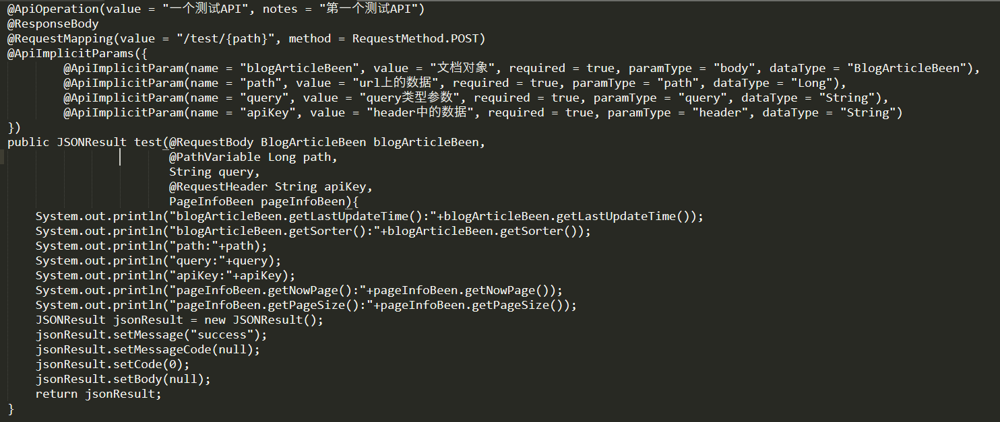
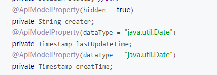
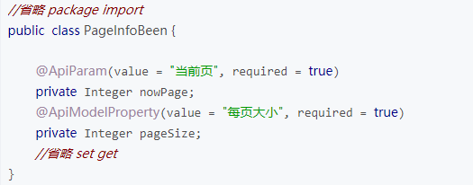
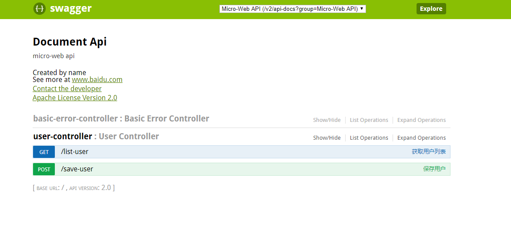
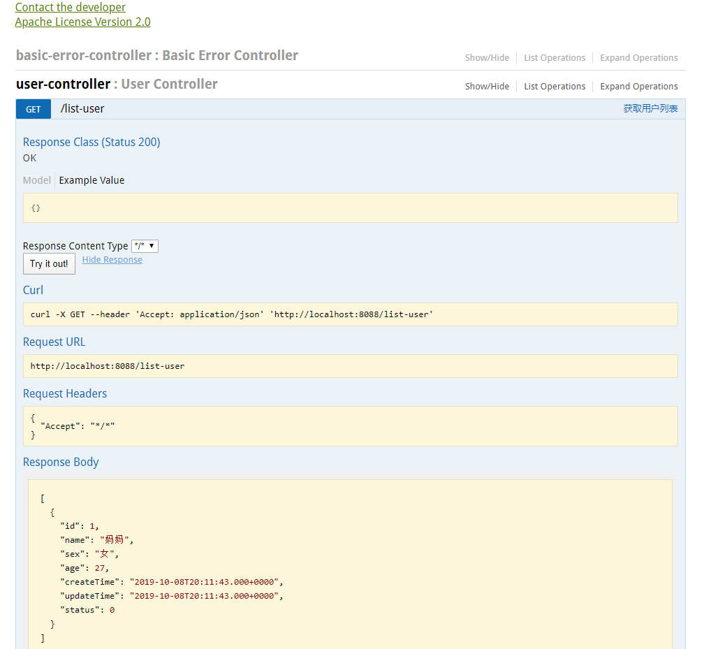

# #Springfox使用

## Springfox(Swagger)

```xml
<dependency>
    <groupId>io.springfox</groupId>
    <artifactId>springfox-swagger2</artifactId>
    <version>2.6.1</version>
</dependency>
<dependency>
    <groupId>io.springfox</groupId>
    <artifactId>springfox-swagger-ui</artifactId>
    <version>2.6.1</version>
</dependency>
```

依赖支持:

```xml
<!--jackson用于将springfox返回的文档对象转换成JSON字符串 -->
<dependency>
    <groupId>com.fasterxml.jackson.core</groupId>
    <artifactId>jackson-annotations</artifactId>
    <version>2.8.6</version>
</dependency>
<dependency>
    <groupId>com.fasterxml.jackson.core</groupId>
    <artifactId>jackson-databind</artifactId>
    <version>2.8.6</version>
</dependency>
<dependency>
    <groupId>com.fasterxml.jackson.core</groupId>
    <artifactId>jackson-core</artifactId>
    <version>2.8.6</version>
</dependency>
```

JavaConfig:

```java
@Configuration
@EnableSwagger2
public class SwaggerConfig {

    @Bean
    public Docket adminApi() {
        return new Docket(DocumentationType.SWAGGER_2)
                .groupName("Micro-Web API")
                .forCodeGeneration(true)
                .pathMapping("/")
                .select()
                .build()
                .apiInfo(apiInfo())
                .useDefaultResponseMessages(false);
    }

    private ApiInfo apiInfo() {
        Contact contact = new Contact("name", "www.baidu.com", "xxxx@qq.com");
        return new ApiInfoBuilder()
                .title("Document Api")
                .description("micro-web api")
                .license("Apache License Version 2.0")
                .contact(contact)
                .version("2.0")
                .build();
    }
}
```

实现`WebMvcConfigurer`​接口，过滤`swagger-ui`​等静态资源

```java
@Override
public void addResourceHandlers(ResourceHandlerRegistry registry) {
    registry.addResourceHandler("swagger-ui.html").addResourceLocations("classpath:/META-INF/resources/");
    registry.addResourceHandler("/webjars/**").addResourceLocations("classpath:/META-INF/resources/webjars/");
}
```

完整配置：

```java
@Configuration
@EnableSwagger2
public class SwaggerConfig implements WebMvcConfigurer {

    @Bean
    public Docket adminApi() {
        return new Docket(DocumentationType.SWAGGER_2)
                .groupName("Micro-Web API")
                .forCodeGeneration(true)
                .pathMapping("/")
                .select()
                .build()
                .apiInfo(apiInfo())
                .useDefaultResponseMessages(false);
    }

    private ApiInfo apiInfo() {
        Contact contact = new Contact("name", "www.baidu.com", "xxxx@qq.com");
        return new ApiInfoBuilder()
                .title("Document Api")
                .description("micro-web api")
                .license("Apache License Version 2.0")
                .contact(contact)
                .version("2.0")
                .build();
    }

    @Override
    public void addResourceHandlers(ResourceHandlerRegistry registry) {
        registry.addResourceHandler("swagger-ui.html").addResourceLocations("classpath:/META-INF/resources/");
        registry.addResourceHandler("/webjars/**").addResourceLocations("classpath:/META-INF/resources/webjars/");
    }
}
```

## 相关注解

> @Api("用户控制器") 
>
> @ApiOperation(value = "保存用户", httpMethod = "POST")

​​

​​

 ​

应用启动，访问：

> http://ip:port/swagger-ui.html

​​

​​
