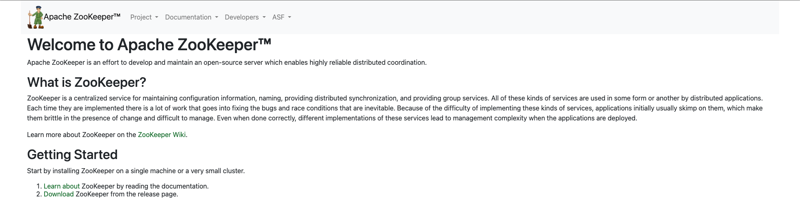

# #Zookeeper

# 安装&基本使用

1. 安装过程略(使用docker比较方便，故略)
2. 进入docker执行命令

    > docker exec -it [容器id] /bin/bash
    >
    > ./zkCli.sh -server 127.0.0.1:2181
    >
3. 列出所有节点、查看节点、创建节点、删除节点

    > ls /
    >
    > get /path
    >
    > create /path value
    >
    > delete /path
    >

# 开发入门

## 引入依赖

```xml
<dependency>
    <groupId>org.apache.zookeeper</groupId>
    <artifactId>zookeeper</artifactId>
    <version>3.5.5</version>
</dependency>
```

## 建立连接

```java
@Slf4j
public class ZKUtil implements Watcher {

    private static String serviceAddress = "127.0.0.1:2181";
    private static CountDownLatch latch = new CountDownLatch(1);
    private static ZooKeeper zk = null;
    private static Stat stat = new Stat();
    private static final int SESSION_TIMEOUT = 30 * 1000;

    public static void main(String[] args) throws Exception {
        String path = "/test/app/vivo";
        zk = new ZooKeeper(serviceAddress, SESSION_TIMEOUT, new ZKUtil());
        latch.await();
        if (zk.exists(path, false) == null) {
            cascadeCreate(zk, path, "hello world 2");
        } else {
            zk.setData(path, "hello world 2".getBytes(), -1);
        }
        log.info(new String(zk.getData(path, true, stat)));
        System.in.read();
    }

    @Override
    public void process(WatchedEvent event) {
        /**
         *             None (-1),
         *             NodeCreated (1),
         *             NodeDeleted (2),
         *             NodeDataChanged (3),
         *             NodeChildrenChanged (4),
         *             DataWatchRemoved (5),
         *             ChildWatchRemoved (6);
         */
        log.info("{} - {} - {}", event.getType(), event.getState(), event.getPath());
        if (Event.KeeperState.SyncConnected == event.getState()) {  //zk连接成功通知事件
            if (Event.EventType.None == event.getType() && null == event.getPath()) {
                latch.countDown();
            } else if (event.getType() == Event.EventType.NodeDataChanged) {  //zk目录节点数据变化通知事件
                try {
                    System.out.println("配置已修改，新值为：" + new String(zk.getData(event.getPath(), true, stat)));
                } catch (KeeperException e) {
                    e.printStackTrace();
                } catch (InterruptedException e) {
                    e.printStackTrace();
                }
            } else if (event.getType() == Event.EventType.NodeDeleted) {  //zk目录节点被删除通知事件
                try {
                    System.out.println("节点已经被删除，数据置空");
                } catch (Exception e) {
                }
            }
        }
    }
}
```

## 创建永久节点

```java
zk.create(path, value.getBytes(), ZooDefs.Ids.OPEN_ACL_UNSAFE, CreateMode.PERSISTENT);
```

## 级联创建永久节点

```java
private static void cascadeCreate(ZooKeeper zk, String path, String value) {
    if (StringUtils.isBlank(path)) {
        return;
    }
    try {
        if (zk.exists(path, false) != null) {
            return;
        }
        String parentPath = path.substring(0, path.lastIndexOf("/"));
        if (parentPath.length() > 0) {
            cascadeCreate(zk, parentPath, value);
            zk.create(path, value.getBytes(), ZooDefs.Ids.OPEN_ACL_UNSAFE, CreateMode.PERSISTENT);
        } else {
            zk.create(path, value.getBytes(), ZooDefs.Ids.OPEN_ACL_UNSAFE, CreateMode.PERSISTENT);
        }
    } catch (Exception e) {
        log.error("ZK节点创建失败:{}", e);
    }
}
```

# 扩展

```java
public class ZkUtils {

    private static ObjectMapper objectMapper = new ObjectMapper();

    private static CuratorFramework client = CuratorFrameworkFactory.builder()
            .connectString("10.90.1.32:2181")
            .sessionTimeoutMs(3000)
            .connectionTimeoutMs(5000)
            .retryPolicy(new ExponentialBackoffRetry(1000, 3))
            .build();

    static {
        client.start();
    }

    public static void addNodeChangedListener(String path, Consumer<ZkNode> changeConsumer) {
        CuratorCache cache = CuratorCache.build(client, path);
        CuratorCacheListener cacheListener = CuratorCacheListener.builder()
                .forChanges(((oldNode, node) -> {
                    if (oldNode.equals(node)) {
                        return;
                    }
                    try {
                        changeConsumer.accept(objectMapper.readValue(node.getData(), ZkNode.class));
                    } catch (IOException e) {
                        e.printStackTrace();
                    }
                }))
                .forDeletes(oldNode -> changeConsumer.accept(ZkNode.empty()))
                .build();
        cache.listenable().addListener(cacheListener);
        cache.start();
    }

    /**
     * 创建永久节点同时写入数据
     */
    public static boolean existNode(String path) {
        CuratorFrameworkState state = client.getState();
        if (!state.equals(CuratorFrameworkState.STARTED)) {
            throw new RuntimeException("Zookeeper客户端状态错误");
        }
        try {
            Stat stat = client.checkExists().creatingParentsIfNeeded().forPath(path);
            if (stat != null) {
                return true;
            }
        } catch (Exception e) {
            throw new RuntimeException(e.getMessage());
        }
        return false;
    }

    /**
     * 创建永久节点同时写入数据
     */
    public static void createNode(String path, ZkNode data) {
        CuratorFrameworkState state = client.getState();
        if (!state.equals(CuratorFrameworkState.STARTED)) {
            throw new RuntimeException("Zookeeper客户端状态错误");
        }
        try {
            client.create().creatingParentsIfNeeded().withMode(CreateMode.PERSISTENT).forPath(path, objectMapper.writeValueAsBytes(data));
        } catch (Exception e) {
            throw new RuntimeException(e.getMessage());
        }
    }

    /**
     * 变更节点数据
     */
    public static void changeNodeData(String path, ZkNode newData) {
        CuratorFrameworkState state = client.getState();
        if (!state.equals(CuratorFrameworkState.STARTED)) {
            throw new RuntimeException("Zookeeper客户端状态错误");
        }
        try {
            client.setData().forPath(path, objectMapper.writeValueAsBytes(newData));
        } catch (Exception e) {
            throw new RuntimeException(e.getMessage());
        }
    }

    /**
     * 获取节点数据
     */
    public static ZkNode getData(String path) {
        CuratorFrameworkState state = client.getState();
        if (!state.equals(CuratorFrameworkState.STARTED)) {
            throw new RuntimeException("Zookeeper客户端状态错误");
        }
        try {
            byte[] bytes = client.getData().forPath(path);
            if (bytes != null && bytes.length > 0) {
                return objectMapper.readValue(client.getData().forPath(path), ZkNode.class);
            }
            return ZkNode.path(path);
        } catch (Exception e) {
            throw new RuntimeException(e.getMessage());
        }
    }

    /**
     * 删除节点及子节点
     */
    public static void deleteNode(String path) {
        CuratorFrameworkState state = client.getState();
        if (!state.equals(CuratorFrameworkState.STARTED)) {
            throw new RuntimeException("Zookeeper客户端状态错误");
        }
        try {
            client.delete().guaranteed().deletingChildrenIfNeeded().forPath(path);
        } catch (Exception e) {
            throw new RuntimeException(e.getMessage());
        }
    }
}
```
