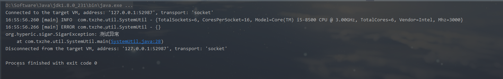

# 日志logback使用

## 1、引入pom

```xml
<dependency>
    <groupId>ch.qos.logback</groupId>
    <artifactId>logback-classic</artifactId>
    <version>1.2.3</version>
</dependency>
<dependency>
    <groupId>ch.qos.logback</groupId>
    <artifactId>logback-core</artifactId>
    <version>1.2.3</version>
</dependency>
<dependency>
    <groupId>org.slf4j</groupId>
    <artifactId>slf4j-api</artifactId>
    <version>1.7.29</version>
</dependency>
<!-- lombok可引可不引入 这里主要是为了@Slf4j注解的使用 -->
<dependency>
    <groupId>org.projectlombok</groupId>
    <artifactId>lombok</artifactId>
    <version>1.18.12</version>
</dependency>
```

## 2、logback.xml的复制 (一般常用就两种：输出到控制台，输出到日志文件)

官网：http://logback.qos.ch/manual/appenders.html#FileAppender

```xml
<?xml version="1.0" encoding="UTF-8"?>
<configuration>
    <!-- ConsoleAppender 输出日志到控制台 -->
    <appender name="CONSOLE-DEFAULT" class="ch.qos.logback.core.ConsoleAppender">
        <encoder>
            <pattern>%d{HH:mm:ss.SSS} [%thread] %-5level %logger{36} - %msg%n</pattern>
        </encoder>
    </appender>

    <!-- FileAppender 输出日志到文件 -->
    <appender name="FILE" class="ch.qos.logback.core.FileAppender">
        <file>testFile.log</file>
        <append>true</append>
        <!-- set immediateFlush to false for much higher logging throughput -->
        <immediateFlush>true</immediateFlush>
        <!-- encoders are assigned the type
             ch.qos.logback.classic.encoder.PatternLayoutEncoder by default -->
        <encoder>
            <pattern>%-4relative [%thread] %-5level %logger{35} - %msg%n</pattern>
        </encoder>
    </appender>
    <!-- FileAppender 循环输出日志到文件 -->
    <!--<appender name="RollingFILE" class="ch.qos.logback.core.rolling.RollingFileAppender">
        <file>logFile.log</file>
        <rollingPolicy class="ch.qos.logback.core.rolling.TimeBasedRollingPolicy">
            &lt;!&ndash; daily rollover &ndash;&gt;
            <fileNamePattern>logFile.%d{yyyy-MM-dd}.log</fileNamePattern>

            &lt;!&ndash; keep 30 days' worth of history capped at 3GB total size &ndash;&gt;
            <maxHistory>30</maxHistory>
            <totalSizeCap>3GB</totalSizeCap>
        </rollingPolicy>
        <encoder>
            <pattern>%-4relative [%thread] %-5level %logger{35} - %msg%n</pattern>
        </encoder>
    </appender>-->

    <root level="INFO">
        <appender-ref ref="FILE"/>
        <!--<appender-ref ref="RollingFILE" />-->
        <appender-ref ref="CONSOLE-DEFAULT"/>
    </root>
</configuration>
```

## 3、代码测试

```java
/**
 * <pre>
 * 1. CPU信息：包括基本信息（vendor、model、mhz、cacheSize）和统计信息（user、sys、idle、nice、wait）
 * 2. 文件系统信息：包括Filesystem、Size、Used、Avail、Use%、Type
 * 3. 事件信息：类似Service Control Manager
 * 4. 内存信息：物理内存和交换内存的总数、使用数、剩余数；RAM的大小
 * 5. 网络信息：包括网络接口信息和网络路由信息
 * 6. 进程信息：包括每个进程的内存、CPU占用数、状态、参数、句柄
 * 7. IO信息：包括IO的状态，读写大小等
 * 8. 服务状态信息
 * 9. 系统信息：包括操作系统版本，系统资源限制情况，系统运行时间以及负载，JAVA的版本信息等
 * </pre>
 */
@Slf4j
public class SystemUtil {

    private static Sigar sigar = new Sigar();

    public static void main(String[] args) {
        try {
            log.info("{}", sigar.getCpuInfoList());
            throw new SigarException("测试异常");
        } catch (SigarException e) {
            log.error("{}", e);
        }
    }
}
```

## 4、运行结果



