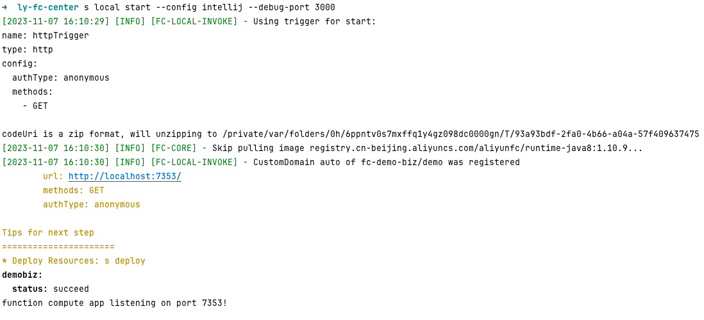
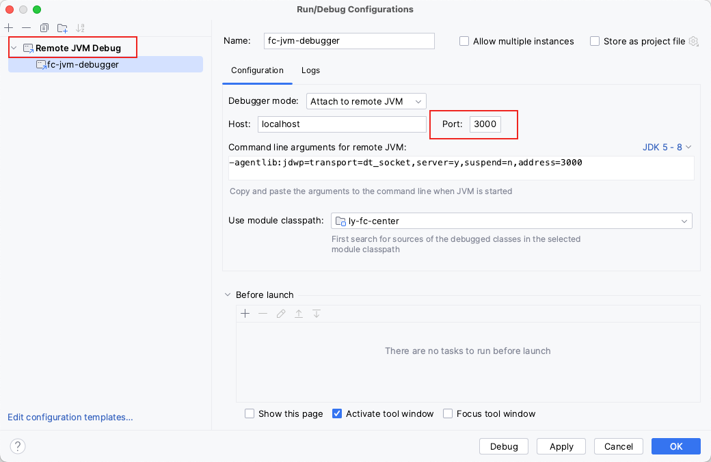

# #Serverless 开发者平台

[https://github.com/Serverless-Devs/Serverless-Devs](https://github.com/Serverless-Devs/Serverless-Devs "https://github.com/Serverless-Devs/Serverless-Devs")

# 安装

使用npm全局安装，前提需要安装node环境

```bash
npm install @serverless-devs/s -g
```

过程中，可能需要填写Accesss ID和Access Secret，这个每个云平台皆有相关操作，本文主要以``​为主。

获取密钥页面: [https://usercenter.console.aliyun.com/#/manage/ak](https://usercenter.console.aliyun.com/#/manage/ak "https://usercenter.console.aliyun.com/#/manage/ak")

帮助文档：[https://github.com/devsapp/fc/blob/main/docs/zh/config.md](https://github.com/devsapp/fc/blob/main/docs/zh/config.md "https://github.com/devsapp/fc/blob/main/docs/zh/config.md")

# 基本使用

使用s命令在本地启动一个http服务用来调试http请求，支持调试工具有`vscode`​, `intellij`​, `pycharm`​

**机器需要安装docker**

```bash
s local start --config intellij --debug-port 3000
```

​​

‍

通过浏览器访问 http://localhost:7353/则可访问本地函数代码。上述指定了debug端口，用intellij调试如下图(参考远程调试)

​​

‍

可选参数

|参数全称|参数缩写|Yaml 模式下必填|参数含义|
| ---------------| ----------| -----------------| ------------------------------------------------------------------------------------|
|config|c|选填|指定断点调试时使用的 IDE，可选：`vscode, pycharm, intellij`​<br />指定断点调试端口|
|debug-port|d|选填||
|custom-domain|-|选填|以自定义域名作为 HTTP Server 的访问 url|
|debug-args|-|选填|断点调试时传入的参数，详情见附录中的默认断点调试参数|
|debugger-path|-|选填|自定义断点调试器路径，会将本地指定路径挂载到程序运行环境的 /tmp/debugger_file 之中|
|tmp-dir|-|选填|自定义函数运行环境中 `/tmp`​ 路径的本机挂载路径，默认为 `./.s/tmp/invoke/serviceName/functionName/`​|
|server-port|-|选填|自定义本地监听 HTTP Server 的端口，默认是在 7000 到 8000 间的随机端口|
