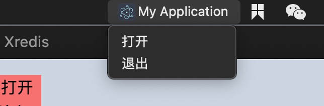

# Electron设置托盘图标信息


## 实现

```js
function createTray() {
  let image = nativeImage.createFromPath(join(__dirname, '../../resources/icon.png'))
  // 重置尺寸
  image = image.resize({
    width: 18,
    height: 18
  })
  // 非模板图片（模板图片可以自适应深色主题）
  image.setTemplateImage(false)
  const tray = new Tray(image)
  const contextMenu = Menu.buildFromTemplate([
    {
      label: '打开',
      click: () => {
        BrowserWindow.getAllWindows().forEach(window => {
          window.show()
        })
      }
    },
    {
      label: '退出',
      click: () => {
        app.quit()
      }
    }
  ])
  tray.setTitle('My Application')
  tray.setToolTip('This is my application.')
  tray.setContextMenu(contextMenu)
}
```

然后调用`createTray`即可


## 效果


