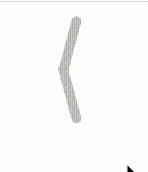

# 箭头形变动画

# 效果


# 代码

```html
<!DOCTYPE html>
<html lang="en">
<head>
<meta charset="UTF-8">
<meta name="viewport" content="width=device-width, initial-scale=1.0">
<title>Transform 示例</title>
<style>
    .transformed-box {
        width: 100px;
        height: 200px;
        position: relative;
        left: 200px;
    }

    .transformed-box .left {
        position: absolute; /* 设置子元素为绝对定位 */
        top: 0;
        width: 10px;
        height: 60px;
        background-color: #ccc;
        transition: transform 0.1s ease; /* 添加过渡效果 */
        border-radius: 100px;
        transform: translateY(0.4rem) rotate(0deg) translateZ(0px);
    }

    .transformed-box .right {
        position: absolute; /* 设置子元素为绝对定位 */
        top: 60px;
        width: 10px;
        height: 60px;
        background-color: #ccc;
        transition: transform 0.1s ease; /* 添加过渡效果 */
        border-radius: 100px;
        transform: translateY(-0.4rem) rotate(0deg) translateZ(0px);    
    }

    .transformed-box:hover .left {
        transform: translateY(0.36rem) rotate(15deg) translateZ(0px);
    }

    .transformed-box:hover .right {
        transform: translateY(-0.36rem) rotate(-15deg) translateZ(0px);
    }
</style>
</head>
<body>
    <div class="transformed-box">
        <div class="left"></div>
        <div class="right"></div>
    </div>
</body>
</html>

```