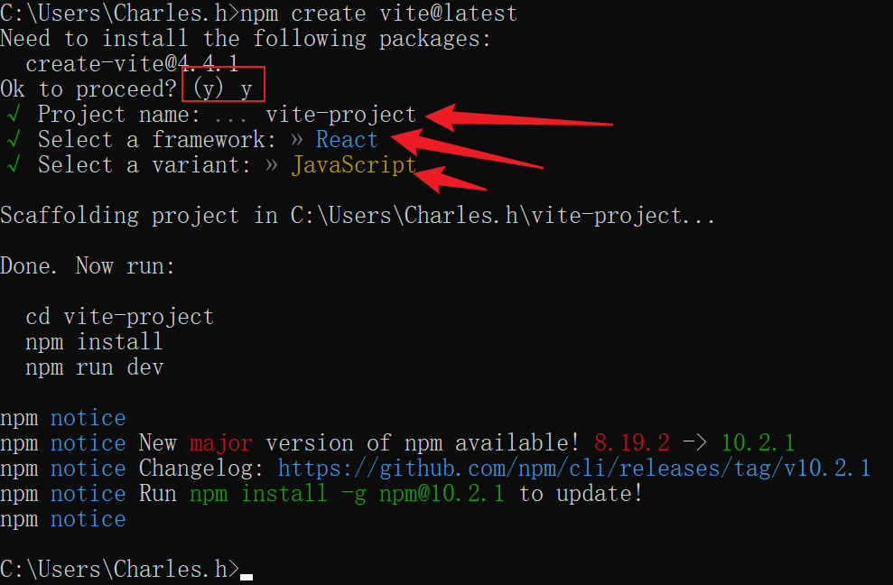
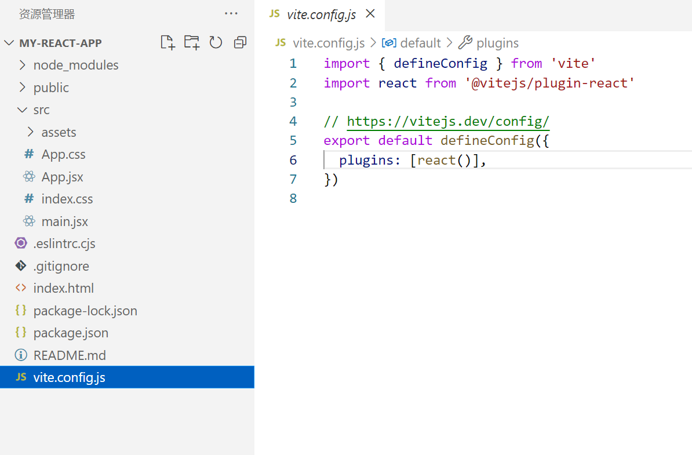
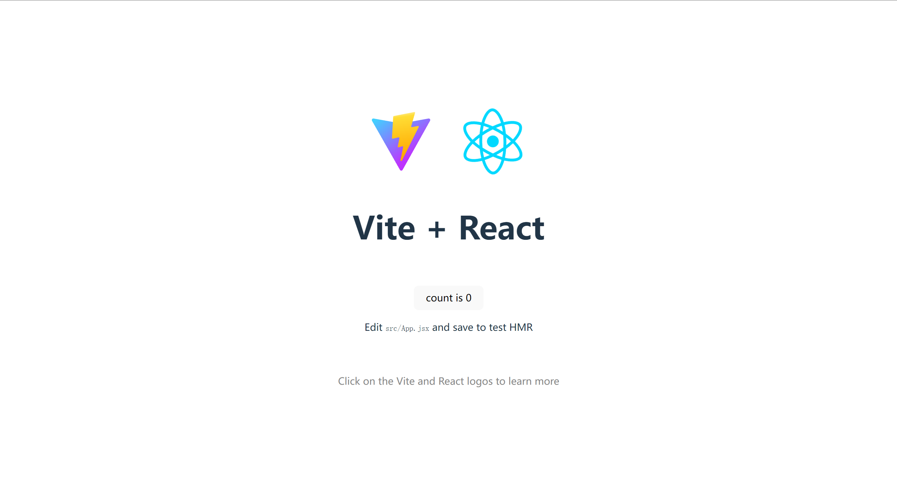

# #Vite - 前端构建工具

# 官网

[https://cn.vitejs.dev/guide](https://cn.vitejs.dev/guide/ "https://cn.vitejs.dev/guide/")

# 支持预设模板

截至2023-10-26

|JavaScript|TypeScript|
| ------------| ------------|
|[vanilla](https://vite.new/vanilla)|[vanilla-ts](https://vite.new/vanilla-ts)|
|[vue](https://vite.new/vue)|[vue-ts](https://vite.new/vue-ts)|
|[react](https://vite.new/react)|[react-ts](https://vite.new/react-ts)|
|[preact](https://vite.new/preact)|[preact-ts](https://vite.new/preact-ts)|
|[lit](https://vite.new/lit)|[lit-ts](https://vite.new/lit-ts)|
|[svelte](https://vite.new/svelte)|[svelte-ts](https://vite.new/svelte-ts)|
|[solid](https://vite.new/solid)|[solid-ts](https://vite.new/solid-ts)|
|[qwik](https://vite.new/qwik)|[qwik-ts](https://vite.new/qwik-ts)|

# 使用npm安装vite

```bash
npm create vite@latest
```

​

根据提示，进入目录，执行install；目录结构如下

​

运行效果

​

# Vite配置

参考: [https://cn.vitejs.dev/config/server-options.html](https://cn.vitejs.dev/config/server-options.html "https://cn.vitejs.dev/config/server-options.html")

‍
