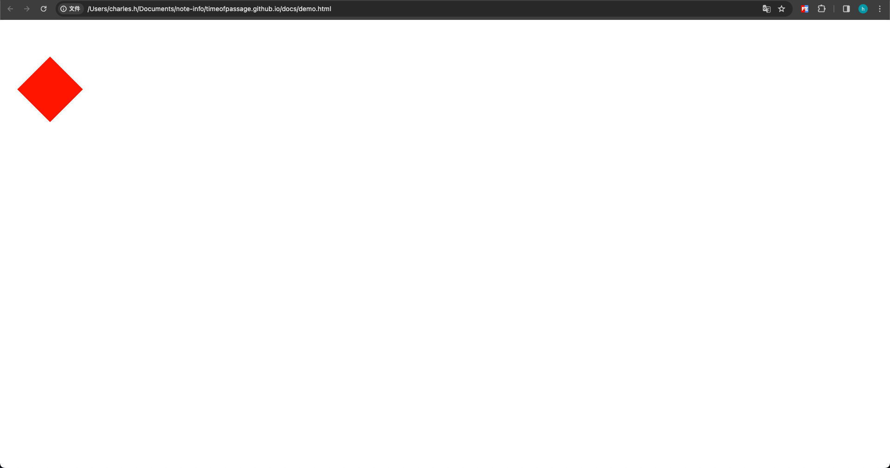

# CSS属性之transform


# transform是什么

transform是css的一个属性，和width、height一样。


# transform作用是什么

用于对元素进行变换，例如平移、旋转、缩放等，而不影响文档流。


# 用法

通过指定变换函数和参数来实现元素的变换。

# 示例

```css
.my-element {
  transform: translateX(50px) rotate(45deg);
}
```

包含类样式`my-element`的节点元素，将要在X轴平移50像素，旋转45度.

上述示例中，.my-element 将水平平移50像素并以45度角旋转。




# 总结

总的来说，transform 用于对元素进行各种变换，使其具有平移、旋转、缩放等动画效果。它们可以结合使用，通过在 :hover 或其他状态下应用 transform 来触发过渡效果。

像其他css属性一样使用即可

# API

## 平移（Translate）：

* translateX(x)：沿 X 轴方向平移元素。
* translateY(y)：沿 Y 轴方向平移元素。
* translate(x, y)：同时在 X 和 Y 轴方向平移元素。

```html
<!DOCTYPE html>
<html lang="en">
<head>
    <meta charset="UTF-8">
    <meta name="viewport" content="width=device-width, initial-scale=1.0">
    <title>CSS</title>
    <style>
        .my-element {
            width: 100px;
            height: 100px;
            margin-top: 100px;
            background-color: red;
        }
        .my-element:hover {
            transform: translate(100px,100px);
        }
    </style>
</head>
<body>
    <div class="my-element"></div>
</body>
</html>
```

<video controls="controls"  src="/计算机时代/前端系列/assets/csstransform01.mov" width="100%"></video>

<video controls="controls"  src="/计算机时代/前端系列/assets/csstransform02.mov" width="100%"></video>


## 旋转（Rotate）：

* rotate(angle)：围绕元素的原点旋转指定角度。


## 缩放（Scale）：

* scaleX(x)：在 X 轴方向上缩放元素。
* scaleY(y)：在 Y 轴方向上缩放元素。
* scale(x, y)：同时在 X 和 Y 轴方向上缩放元素。


## 倾斜（Skew）：

* skewX(angle)：在 X 轴方向上倾斜元素。
* skewY(angle)：在 Y 轴方向上倾斜元素。
* skew(x-angle, y-angle)：同时在 X 和 Y 轴方向上倾斜元素。


## 原点变换（Transform Origin）：

* transform-origin：定义变换的原点，即变换的中心点。

## 矩阵变换（Matrix）：

* matrix(a, b, c, d, e, f)：通过一个 2D 矩阵变换来实现复杂的变换。六个参数分别代表矩阵的各个值。


Tips: 这些变换函数可以单独使用，也可以组合在一起实现更复杂的变换效果。例如，你可以通过组合 translate, rotate, 和 scale 来创建更丰富的动画和布局效果。


