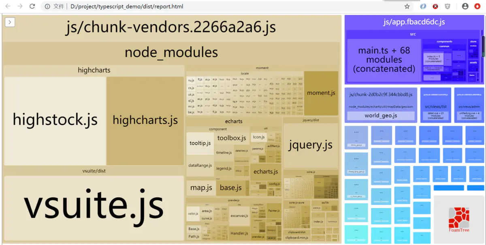

# Vue-VueElementAdmin优化加载

## 1. 集成三方框架，利用CDN优化加载

### 1.1 以vue-element-ui为例改造   传送门：[vue-element-ui](https://panjiachen.github.io/vue-element-admin-site/zh/guide/advanced/cdn.html)

### 修改vue.config.js ,在configureWebpack下新增externals结构

```js
configureWebpack: {
  name: name,
    resolve: {
      alias: {
        '@': resolve('src')
      }
    },
   ///////////////BEGIN//////////////////////
   // 这里属于新增外部引用
   externals: {
      vue: 'Vue',
      'element-ui': 'ELEMENT'
   }
  ///////////////END//////////////////////
},
```

### chainWebpack(config)中配置CDN链接（注意和externals顺序一致），并通过html-webpack-plugin插件引用

```js
chainWebpack(config) {
    ///////////////BEGIN//////////////////////
		const cdn = {
			css: [
				// element-ui css
				'https://unpkg.com/element-ui/lib/theme-chalk/index.css'
			],
			js: [
				// vue must at first!
				'https://unpkg.com/vue/dist/vue.js',
				// element-ui js
				'https://unpkg.com/element-ui/lib/index.js'
			]
		}
    config.plugin('html')
      .tap(args => {
        args[0].cdn = cdn
        return args
      });
   ///////////////END//////////////////////
	 config.plugins.delete('preload') // TODO: need test
	 config.plugins.delete('prefetch') // TODO: need test
  // 后续配置省略...
```

### 修改public/index.html输出页面，增加css和js引用，关注BEGIN和END中间新增代码

```
<!DOCTYPE html>
<html>
  <head>
    <meta charset="utf-8">
    <meta http-equiv="X-UA-Compatible" content="IE=edge,chrome=1">
    <meta name="viewport" content="width=device-width, initial-scale=1, maximum-scale=1, user-scalable=no">
    <link rel="icon" href="<%= BASE_URL %>favicon.ico">
    <title><%= webpackConfig.name %></title>
     <!-- ----------------------------BEGIN---------------------------- --> 
      <!-- 引入样式 -->
      <% for(var css of htmlWebpackPlugin.options.cdn.css) { %>
        <link rel="stylesheet" href="<%=css%>">
      <% } %>
       <!-- ----------------------------END---------------------------- --> 
  </head>
  <body>
    <noscript>
      <strong>We're sorry but <%= webpackConfig.name %> doesn't work properly without JavaScript enabled. Please enable it to continue.</strong>
    </noscript>
      <!-- ----------------------------BEGIN---------------------------- --> 
      <!-- 引入JS -->
      <% for(var js of htmlWebpackPlugin.options.cdn.js) { %>
        <script src="<%=js%>"></script>
      <% } %>
       <!-- ----------------------------BEGIN---------------------------- --> 
    <div id="app"></div>
    <!-- built files will be auto injected -->
  </body>
</html>
```

## 注释main.js\store.js相关Vue.use引用

### main.js

```js
import Vue from 'vue'

import 'normalize.css/normalize.css' // A modern alternative to CSS resets

// import ElementUI from 'element-ui'
// import 'element-ui/lib/theme-chalk/index.css'
// import locale from 'element-ui/lib/locale/lang/en' // lang i18n

import '@/styles/index.scss' // global css

import App from './App'
import store from './store'
import router from './router'

import '@/icons' // icon
import '@/permission' // permission control

/**
 * If you don't want to use mock-server
 * you want to use MockJs for mock api
 * you can execute: mockXHR()
 *
 * Currently MockJs will be used in the production environment,
 * please remove it before going online ! ! !
 */
// if (process.env.NODE_ENV === 'production') {
//   const { mockXHR } = require('../mock')
//   mockXHR()
// }

// set ElementUI lang to EN
// Vue.use(ElementUI, { locale })
// 如果想要中文版 element-ui，按如下方式声明
// Vue.use(ElementUI)

Vue.config.productionTip = false

new Vue({
  el: '#app',
  router,
  store,
  render: h => h(App)
})
```

### store.js

```js
// import Vue from 'vue'
import Vuex from 'vuex'
import getters from './getters'
import app from './modules/app'
import settings from './modules/settings'
import permission from './modules/permission'
import user from './modules/user'

// Vue.use(Vuex)

const store = new Vuex.Store({
  modules: {
    app,
    permission,
    settings,
    user
  },
  getters
})

export default store
```

router.js 中Vue也可以移除

## 通过 `npm run preview -- --report`进行打包分析

