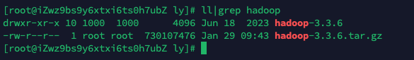
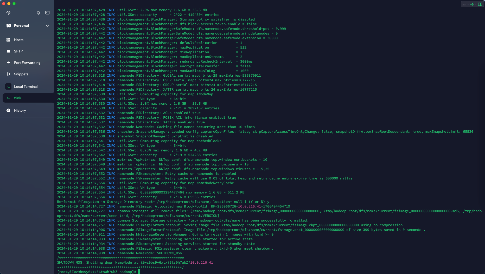
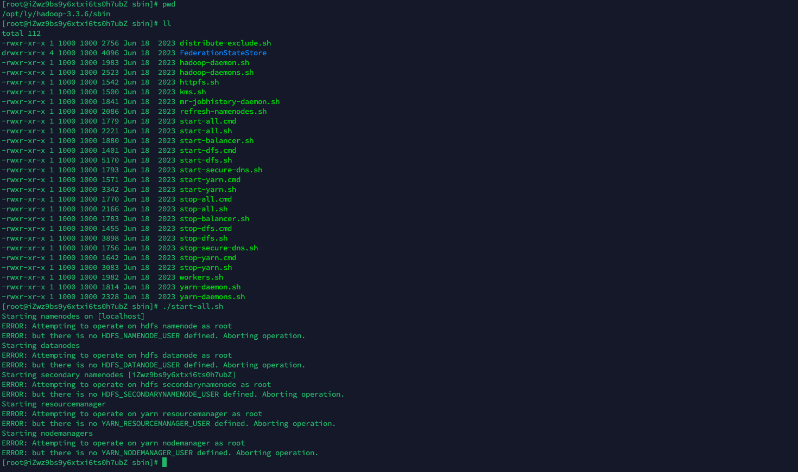
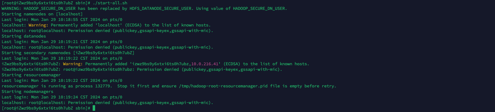
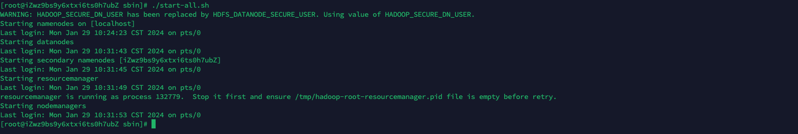

# Hadoop搭建细节

## 下载


> [!NOTE|label:下载地址]
> https://hadoop.apache.org/releases.html

## 解压

```bash
tar -zxvf hadoop-3.3.6.tar.gz
```



## 配置环境变量


```
export HADOOP_HOME=/opt/ly/hadoop-3.3.6
PATH=$PATH:$HOME/bin:$HADOOP_HOME/bin 
```

## 修改hadoop下的/etc/hadoop/core-site.xml文件

```xml
<configuration>
    <property>
        <name>fs.defaultFS</name>
        <value>hdfs://localhost:9000</value>
    </property>
</configuration>
```

这里的`localhost`是您的本地主机名，`9000`是Hadoop默认的NameNode端口号。

## 修改hadoop下的/etc/hadoop/hdfs-site.xml文件

```xml
<configuration>
    <property>
        <name>dfs.replication</name>
        <value>1</value>
    </property>
</configuration>
```

这里的`dfs.replication`设置了数据块的副本数，这里设置为1。

## 格式化Hadoop文件系统

```bash
hdfs namenode -format
```



## 进入sbin目录下启动hadoop（start-all.sh)



使用root配置的hadoop并启动会出现报错，会提示如图错误。

**解决方法：**

在`/hadoop/sbin`路径下：将`start-dfs.sh`，`stop-dfs.sh`两个文件顶部添加以下参数

 ```properties
 HDFS_DATANODE_USER=root
 HADOOP_SECURE_DN_USER=hdfs
 HDFS_NAMENODE_USER=root
 HDFS_SECONDARYNAMENODE_USER=root
 ```

 `start-yarn.sh`，`stop-yarn.sh`顶部也需添加以下

```properties
YARN_RESOURCEMANAGER_USER=root
HADOOP_SECURE_DN_USER=yarn
YARN_NODEMANAGER_USER=root
```

## 进入sbin目录下再次启动hadoop（start-all.sh)



依旧报错，是因为没有设置免密登陆，**解决办法：配置免密登陆（本机也需要配置）**

1. 执行下面命令，一路回车到底。

   ```bash
   ssh-keygen -t rsa
   ```

2. 进入`/root/.ssh`目录，执行如下命令

   ```bash
   # 新建文件
   touch authorized_keys
   # 赋权
   chmod 600 authorized_keys
   # 公钥追加到文件中
   cat id_rsa.pub >> authorized_keys
   ```

3. 验证

   ```bash
   ssh root@本机器名
   ```

## 进入sbin目录下再次启动hadoop（start-all.sh)


还是报错，提示上述没有`JAVA_HOME`变量。**解决办法：在hadoop-env.sh中，再显示地重新声明一遍JAVA_HOME**

`etc/hadoop/hadoop-env.sh`

```bash
# 省略....
# The java implementation to use. By default, this environment
# variable is REQUIRED on ALL platforms except OS X!
# export JAVA_HOME=
export JAVA_HOME=/opt/ly/jdk1.8.0_202
# 省略....
```

## 进入sbin目录下再次启动hadoop（start-all.sh)



启动成功。

## 利用JPS查看服务 `jps`


发现Hadoop所有服务已经启动，包含（NameNode、DataNode、SecondaryNameNode、ResourceManager、NodeManager）。