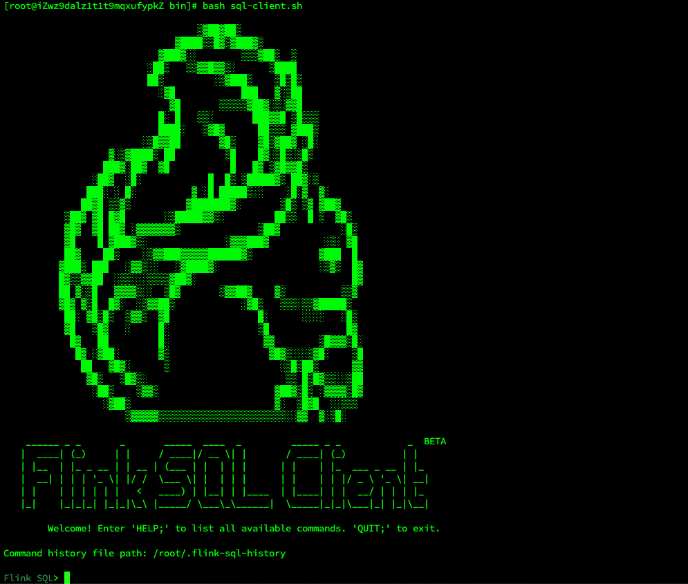

# Flink-SQL同步示例

> 本篇主要演示如何通过Flink SQL Client添加Job任务


## 首先进入Flink SQL Client

```bash
# 脚本目录: flink-1.18.1/bin/sql-client.sh

bash flink-1.18.1/bin/sql-client.sh
```

成功后如下图



此时，打开了flink sql的会话。

## 接着，我们创建源表的映射表

假设我们现在源表名为：t_book_order，所属库名为：books，根据源表在flink中根据如下sql建立映射表。

```sql
CREATE TABLE t_book_order_source (
    database_name       STRING METADATA FROM 'database_name' VIRTUAL,
    table_name    STRING METADATA FROM 'table_name' VIRTUAL,
    -- 其他字段1
  	-- 其他字段2
  	-- 其他字段3
  	-- 其他字段xxxxx
    `id` DECIMAL(20, 0) COMMENT '主键id',
    `create_time` TIMESTAMP COMMENT '记录创建时间',
    `update_time` TIMESTAMP COMMENT '记录修改时间',
     PRIMARY KEY(`id`) NOT ENFORCED
) WITH (
     'connector' = 'mysql-cdc',
     'hostname' = 'xxx.x.x.x',
     'port' = '3306',
     'username' = 'xxxxxx',
     'password' = 'xxxxxxx',
     'database-name' = 'books',
     'table-name' = '.*',
  	 'server-id' = '5500-5504',
  	 'server-time-zone' = '+08:00',
  	 'scan.startup.mode' = 'specific-offset',
  	 'scan.startup.specific-offset.file' = 'binlog.000895',
  	 'scan.startup.specific-offset.pos' = '4'
);
```

`server-id`：全局唯一，作为slave同步binlog，因此这个要不一样。同时这里区间数和并发设置`SET 'parallelism.default' = '4';`有关。

```sql
'scan.startup.mode' = 'specific-offset',
'scan.startup.specific-offset.file' = 'binlog.000895',
'scan.startup.specific-offset.pos' = '4'
```

上面这几个配置用于增量同步处理。

具体配置信息可参考文档：https://github.com/apache/flink-cdc/blob/master/docs/content.zh/docs/connectors/cdc-connectors/mysql-cdc.md

### 开启本次任务checkpoint时间

```sql
-- 开启checkpoint
SET execution.checkpointing.interval = 10s;
```

### 设置任务并行度

```sql
-- 设置任务并行度
SET 'parallelism.default' = '4';
```

### 设置任务名称

```sql
-- 设置job名称
SET 'pipeline.name' = '连山RDS增量同步Doris';
```

### 设置从savepoint回复

```sql
-- 从savepoint path恢复
SET 'execution.savepoint.path' = 'file:/opt/ly/flink/flink-savepoints/savepoint-c4d675-ef61ee37790e';
```

### 展示所有jobs

```sql
-- 显示所有jobs
SHOW JOBS;
```


### 生成savepoint后停止任务

```sql
-- 生成savepoint后停止job(jobid)
STOP JOB 'c4d67529130fd35e48f6b1079ff68561' WITH SAVEPOINT;
```

## 如何验证源表任务是否配置正确

```sql
select * from t_book_order_source limit 10;
```

> 在flink sql client中执行上述sql，观察是否存在数据，存在则表示同步配置无误。数据量大且多可能观察时间需要放久一点。
