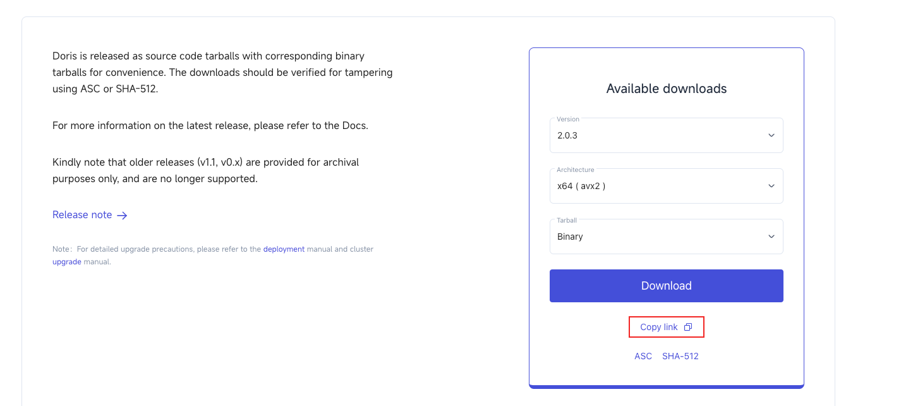
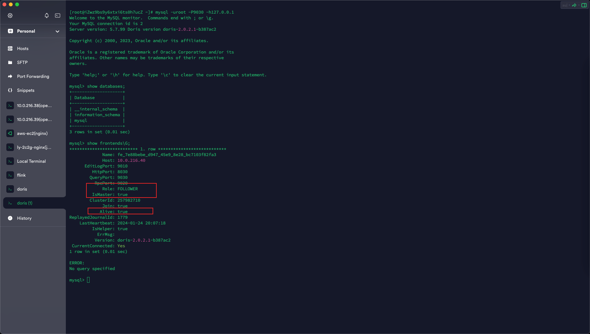

# Doris部署

## 下载

> [!TIP|label:下载地址]
> https://apache-doris-releases.oss-accelerate.aliyuncs.com/apache-doris-2.0.3-bin-x64.tar.gz




至于是avx2表示机器是否支持avx2指令. 可通过下面命令检测

```bash
cat /proc/cpuinfo |grep avx2
```


如果有信息则表示支持avx2指令。

## 部署环境

下载后解压， 然后下载jdk8安装（此步省略）

### 启动FE

#### 修改配置文件fe.conf

```text
# Licensed to the Apache Software Foundation (ASF) under one
# or more contributor license agreements.  See the NOTICE file
# distributed with this work for additional information
# regarding copyright ownership.  The ASF licenses this file
# to you under the Apache License, Version 2.0 (the
# "License"); you may not use this file except in compliance
# with the License.  You may obtain a copy of the License at
#
#   http://www.apache.org/licenses/LICENSE-2.0
#
# Unless required by applicable law or agreed to in writing,
# software distributed under the License is distributed on an
# "AS IS" BASIS, WITHOUT WARRANTIES OR CONDITIONS OF ANY
# KIND, either express or implied.  See the License for the
# specific language governing permissions and limitations
# under the License.

#####################################################################
## The uppercase properties are read and exported by bin/start_fe.sh.
## To see all Frontend configurations,
## see fe/src/org/apache/doris/common/Config.java
#####################################################################

CUR_DATE=`date +%Y%m%d-%H%M%S`

# the output dir of stderr and stdout 
LOG_DIR = ${DORIS_HOME}/log

JAVA_OPTS="-Djavax.security.auth.useSubjectCredsOnly=false -Xss4m -Xmx8192m -XX:+UseMembar -XX:SurvivorRatio=8 -XX:MaxTenuringThreshold=7 -XX:+PrintGCDateStamps -XX:+PrintGCDetails -XX:+UseConcMarkSweepGC
 -XX:+UseParNewGC -XX:+CMSClassUnloadingEnabled -XX:-CMSParallelRemarkEnabled -XX:CMSInitiatingOccupancyFraction=80 -XX:SoftRefLRUPolicyMSPerMB=0 -Xloggc:$DORIS_HOME/log/fe.gc.log.$CUR_DATE"

# For jdk 9+, this JAVA_OPTS will be used as default JVM options
JAVA_OPTS_FOR_JDK_9="-Djavax.security.auth.useSubjectCredsOnly=false -Xss4m -Xmx8192m -XX:SurvivorRatio=8 -XX:MaxTenuringThreshold=7 -XX:+CMSClassUnloadingEnabled -XX:-CMSParallelRemarkEnabled -XX:CMSInit
iatingOccupancyFraction=80 -XX:SoftRefLRUPolicyMSPerMB=0 -Xlog:gc*:$DORIS_HOME/log/fe.gc.log.$CUR_DATE:time"

##
## the lowercase properties are read by main program.
##

# INFO, WARN, ERROR, FATAL
sys_log_level = INFO

# NORMAL, BRIEF, ASYNC
sys_log_mode = NORMAL

# store metadata, must be created before start FE.
# Default value is ${DORIS_HOME}/doris-meta
meta_dir = /opt/ly/doris/fe/doris-meta

priority_networks=10.0.216.0/24

# Default dirs to put jdbc drivers,default value is ${DORIS_HOME}/jdbc_drivers
# jdbc_drivers_dir = ${DORIS_HOME}/jdbc_drivers

http_port = 8030
rpc_port = 9020
query_port = 9030
edit_log_port = 9010

# Choose one if there are more than one ip except loopback address. 
# Note that there should at most one ip match this list.
# If no ip match this rule, will choose one randomly.
# use CIDR format, e.g. 10.10.10.0/24 or IP format, e.g. 10.10.10.1
# Default value is empty.
# priority_networks = 10.10.10.0/24;192.168.0.0/16

# Advanced configurations 
# log_roll_size_mb = 1024
# sys_log_dir = ${DORIS_HOME}/log
# sys_log_roll_num = 10
# sys_log_verbose_modules = org.apache.doris
# audit_log_dir = ${DORIS_HOME}/log
# audit_log_modules = slow_query, query
# audit_log_roll_num = 10
# meta_delay_toleration_second = 10
# qe_max_connection = 1024
# qe_query_timeout_second = 300
# qe_slow_log_ms = 5000
```

主要增加`priority_networks=10.0.216.0/24`和修改`meta_dir = /opt/ly/doris/fe/doris-meta`


#### 启动

```bash
sh bin/start_fe.sh --daemon
```

#### 验证

输入`jps`查看


如果出现`DorisFE`则表示启动成功.

可以通过安装mysql客户端链接查看。

yum可以安装`yum install mysql`

使用下面命令进行连接

```bash
mysql -uroot -P9030 -h127.0.0.1
```


链接成功表示服务启动成功，也可以通过命令`show frontends\G;`命令查看



Alive=true表示服务存活。

### 启动BE

#### 修改be.conf配置

```conf
# Licensed to the Apache Software Foundation (ASF) under one
# or more contributor license agreements.  See the NOTICE file
# distributed with this work for additional information
# regarding copyright ownership.  The ASF licenses this file
# to you under the Apache License, Version 2.0 (the
# "License"); you may not use this file except in compliance
# with the License.  You may obtain a copy of the License at
#
#   http://www.apache.org/licenses/LICENSE-2.0
#
# Unless required by applicable law or agreed to in writing,
# software distributed under the License is distributed on an
# "AS IS" BASIS, WITHOUT WARRANTIES OR CONDITIONS OF ANY
# KIND, either express or implied.  See the License for the
# specific language governing permissions and limitations
# under the License.

CUR_DATE=`date +%Y%m%d-%H%M%S`

PPROF_TMPDIR="$DORIS_HOME/log/"

JAVA_OPTS="-Xmx1024m -DlogPath=$DORIS_HOME/log/jni.log -Xloggc:$DORIS_HOME/log/be.gc.log.$CUR_DATE -Djavax.security.auth.useSubjectCredsOnly=false -Dsun.java.command=DorisBE -XX:-CriticalJNINatives -DJDBC
_MIN_POOL=1 -DJDBC_MAX_POOL=100 -DJDBC_MAX_IDLE_TIME=300000 -DJDBC_MAX_WAIT_TIME=5000"

# For jdk 9+, this JAVA_OPTS will be used as default JVM options
JAVA_OPTS_FOR_JDK_9="-Xmx1024m -DlogPath=$DORIS_HOME/log/jni.log -Xlog:gc:$DORIS_HOME/log/be.gc.log.$CUR_DATE -Djavax.security.auth.useSubjectCredsOnly=false -Dsun.java.command=DorisBE -XX:-CriticalJNINat
ives -DJDBC_MIN_POOL=1 -DJDBC_MAX_POOL=100 -DJDBC_MAX_IDLE_TIME=300000 -DJDBC_MAX_WAIT_TIME=5000"

# since 1.2, the JAVA_HOME need to be set to run BE process.
# JAVA_HOME=/path/to/jdk/
JAVA_HOME=/opt/ly/jdk1.8.0_202/

# https://github.com/apache/doris/blob/master/docs/zh-CN/community/developer-guide/debug-tool.md#jemalloc-heap-profile
# https://jemalloc.net/jemalloc.3.html
JEMALLOC_CONF="percpu_arena:percpu,background_thread:true,metadata_thp:auto,muzzy_decay_ms:15000,dirty_decay_ms:15000,oversize_threshold:0,lg_tcache_max:20,prof:false,lg_prof_interval:32,lg_prof_sample:19
,prof_gdump:false,prof_accum:false,prof_leak:false,prof_final:false"
JEMALLOC_PROF_PRFIX=""

# INFO, WARNING, ERROR, FATAL
sys_log_level = INFO

# ports for admin, web, heartbeat service 
be_port = 9060
webserver_port = 8040
heartbeat_service_port = 9050
brpc_port = 8060

# HTTPS configures
enable_https = false
# path of certificate in PEM format.
ssl_certificate_path = "$DORIS_HOME/conf/cert.pem"
# path of private key in PEM format.
ssl_private_key_path = "$DORIS_HOME/conf/key.pem"

# enable auth check
enable_auth = false

# Choose one if there are more than one ip except loopback address. 
# Note that there should at most one ip match this list.
# If no ip match this rule, will choose one randomly.
# use CIDR format, e.g. 10.10.10.0/24 or IP format, e.g. 10.10.10.1
# Default value is empty.
# priority_networks = 10.10.10.0/24;192.168.0.0/16

# data root path, separate by ';'
# you can specify the storage medium of each root path, HDD or SSD
# you can add capacity limit at the end of each root path, separate by ','
# eg:
# storage_root_path = /home/disk1/doris.HDD,50;/home/disk2/doris.SSD,1;/home/disk2/doris
# /home/disk1/doris.HDD, capacity limit is 50GB, HDD;
# /home/disk2/doris.SSD, capacity limit is 1GB, SSD;
# /home/disk2/doris, capacity limit is disk capacity, HDD(default)
#
storage_root_path = /opt/ly/doris/be/data 
# you also can specify the properties by setting '<property>:<value>', separate by ','
# property 'medium' has a higher priority than the extension of path
#
# Default value is ${DORIS_HOME}/storage, you should create it by hand.
# storage_root_path = ${DORIS_HOME}/storage

# Default dirs to put jdbc drivers,default value is ${DORIS_HOME}/jdbc_drivers
# jdbc_drivers_dir = ${DORIS_HOME}/jdbc_drivers

# Advanced configurations
# sys_log_dir = ${DORIS_HOME}/log
# sys_log_roll_mode = SIZE-MB-1024
# sys_log_roll_num = 10
# sys_log_verbose_modules = *
# log_buffer_level = -1
# palo_cgroups 

priority_networks=10.0.216.0/24
```

主要是`priority_networks=10.0.216.0/24`和`storage_root_path = /opt/ly/doris/be/data `配置关注

#### 启动

```bash
sh bin/start_be.sh --daemon
# 可能需要执行下面命令
sysctl -w vm.max_map_count=2000000
ulimit -n 65536
```

#### 验证

输入`jps`查看


如果存在`DorisBE`则表示服务启动成功。

当BE服务启动的时候，我们需要通过下面命令将BE添加到集群中。

```mysql
ALTER SYSTEM ADD BACKEND "10.0.216.40:9050";
```

9050是默认端口。ip必须是priority_networks内的ip地址。

添加成功后则可以通过命令`show backends\G;`查看。


Alive=true表示服务存活。


#### 辅助命令

如果添加BE节点错误，可以通过下面命令下线BE节点

```mysql
ALTER SYSTEM DECOMMISSION BACKEND "be_host_ip:heartbeat_service_port";
```

也可以通过下面的命令进行快速删除（**仅限新加加点，生产慎用**）

```mysql
ALTER SYSTEM DROPP BACKEND "be_host_ip:heartbeat_service_port";
```

修改密码参考：

https://doris.apache.org/zh-CN/docs/1.2/sql-manual/sql-reference/Account-Management-Statements/SET-PASSWORD/

### 访问

通过访问FE的8030端口进入WEB管理界面。


用户名：root，密码默认为空。

点击`System`下的backends，可以发现BE节点。


当然也可通过`Playground`菜单进行在线执行sql命令处理。


至此，单独FE、BE搭建完毕。