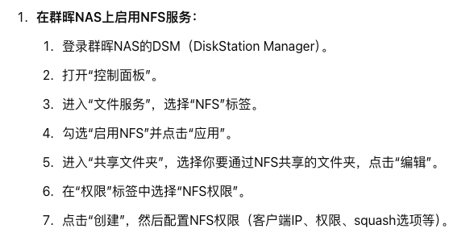

# Ubuntu挂载Nas操作

## 群晖NAS示例



## Ubuntu安装客户端

```bash
sudo apt update
sudo apt install nfs-common
```

## 创建挂载点

```bash
sudo mkdir -p /mnt/nas
```

## 挂载共享

```bash
sudo mount -t nfs <群晖NAS_IP>:/path/to/nfs/share /mnt/nas
```

## 验证挂载

```bash
df -h
```

## 配置自动挂载

```bash
sudo vim /etc/fstab
```

最后一行添加

```bash
<群晖NAS_IP>:/path/to/nfs/share /mnt/nas nfs defaults 0 0
```

测试命令
```bash
sudo mount -a
```

## 卸载

```bash
sudo umount -v /mnt/nas
```