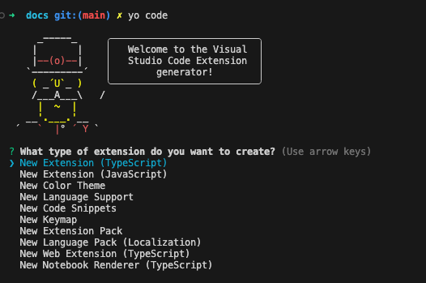
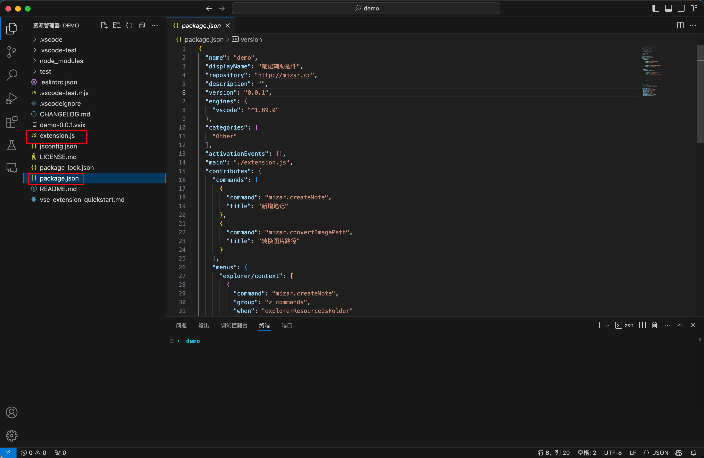

# VSCode插件开发步骤


## 预先工作

> 安装 yo 命令

```bash
npm install -g yo
npm install -g generator-code
```

## 生成代码

```bash
yo code
```

出现如下选择，通过上下方向键选择, 然后根据提示操作.



## 插件项目结构




`extension.js`在`package.json`中配置的入口文件

## 开发示例：注册右键“新建笔记”菜单

```js
// The module 'vscode' contains the VS Code extensibility API
// Import the module and reference it with the alias vscode in your code below
const vscode = require('vscode');

// This method is called when your extension is activated
// Your extension is activated the very first time the command is executed

/**
 * @param {vscode.ExtensionContext} context
 */
function activate(context) {

	// Use the console to output diagnostic information (console.log) and errors (console.error)
	// This line of code will only be executed once when your extension is activated
	console.log('Congratulations, your extension "demo" is now active!');

	// The command has been defined in the package.json file
	// Now provide the implementation of the command with  registerCommand
	// The commandId parameter must match the command field in package.json
	let disposable = vscode.commands.registerCommand('mizar.createNote', function (resource) {
		// 打开一个 input
		vscode.window.showInputBox({
			ignoreFocusOut: true, // 当焦点移动到编辑器的另一部分或另一个窗口时, 保持输入框打开
			password: false, // 为 true 就表示是密码类型
			prompt: "请输入文本", // 文本输入提示
		}).then(value => {
			if (!value || !value?.trim()) {
				vscode.window.showErrorMessage("你输入的文本无效");
				return;
			};
			// 读取目录下_siderbar.md的内容
			const fs = require('fs');
			const path = require('path');
			let prefix = resource ? resource.path : vscode.workspace.rootPath;
			const sidebarPath = path.join(prefix, '_sidebar.md');

			// 11.VSCode插件开发步骤.md => 取.中间的内容
			let arr = value.split('.');
			let newContent = `- [${arr[1]}](${prefix.replace(vscode.workspace.workspaceFolders[0].uri.path, '')}/${value})\n`;
			// 如果sidebarPath不存在，则创建一个
			if (fs.existsSync(sidebarPath)) {
				const sidebarContent = fs.readFileSync(sidebarPath, 'utf-8');
				// 在内容后追加: - [记一次知识库丢失经历](/生活漫谈/出去走走/3.记一次知识库丢失经历.md)
				if (sidebarContent.endsWith('\n')) {
					fs.writeFileSync(sidebarPath, sidebarContent + newContent);
				} else {
					fs.writeFileSync(sidebarPath, sidebarContent + '\n' + newContent);
				}
			} else {
				fs.writeFileSync(sidebarPath, newContent);
			}
			// 在当前选中目录下创建一个文件
			const filePath = path.join(prefix, value);
			fs.writeFileSync(filePath, `# ${arr[1]}\n\n`);
			vscode.window.showInformationMessage("笔记创建成功");
			// 打开文件
			vscode.workspace.openTextDocument(filePath).then(doc => {
				vscode.window.showTextDocument(doc);
			});
		});
	});

	context.subscriptions.push(disposable);
}

// This method is called when your extension is deactivated
function deactivate() { }

module.exports = {
	activate,
	deactivate
}
```


## 开发示例：注册右键“转换图片路径”菜单

```js
// The module 'vscode' contains the VS Code extensibility API
// Import the module and reference it with the alias vscode in your code below
const vscode = require('vscode');

// This method is called when your extension is activated
// Your extension is activated the very first time the command is executed

/**
 * @param {vscode.ExtensionContext} context
 */
function activate(context) {
	// 转换图片路径 
	// 1. 选中需要转换的图片路径  
	// 2. 获取当前文档名称
	// 3. 获取时间戳
	// 4. 复制图片到当前文档目录的assset目录下
	// 5. 替换图片路径 
	let disposableCIP = vscode.commands.registerCommand('mizar.convertImagePath', function () {
		let editor = vscode.window.activeTextEditor;
		if (!editor) {
			vscode.window.showErrorMessage("请打开一个文档");
			return;
		}
		let selection = editor.selection;
		let text = editor.document.getText(selection);
		if (!text) {
			vscode.window.showErrorMessage("请选中图片路径");
			return;
		}
		try {
			// 获取当前文档名称
			let docName = editor.document.fileName.split('/').pop();
			// 去除前后.； 计算相对路径
			let newDocName = docName.split('.')[1];
			// 获取时间戳
			let timestamp = new Date().getTime();
			// 复制图片到当前文档目录的assset目录下
			const fs = require('fs');
			const path = require('path');
			const imgPath = text.match(/\(([^)]*)\)/)[1];
			// 获取图片后缀
			const imageExt = imgPath.split('.')[1];
			let currentPath = editor.document.fileName.replace(docName, '');
			let assetsPath = path.join(currentPath, 'assets');
			let newImgName = `${newDocName}${timestamp}.${imageExt}`;
			const imgAbsoultePath = path.join(assetsPath, newImgName);
			// imgNewPath不存在则创建
			if (!fs.existsSync(assetsPath)) {
				fs.mkdirSync(assetsPath);
			}
			let oldImagePath = path.join(currentPath, imgPath);
			fs.copyFileSync(oldImagePath, imgAbsoultePath);
			// 删除原图片
			fs.unlinkSync(oldImagePath);
			// 替换图片路径
			editor.edit(editBuilder => {
				editBuilder.replace(selection, ``);
			});
		} catch (e) {
			vscode.window.showErrorMessage("图片路径转换失败"+ e);
		}
	});
	context.subscriptions.push(disposableCIP);
}

// This method is called when your extension is deactivated
function deactivate() { }

module.exports = {
	activate,
	deactivate
}
```

## 调试

1. `F5`键运行调试
2. 可通过`debugger`等进行调试.
3. 可打开控制台查看`console`等输出

## 打包

```bash
npm run vsce package
```

执行成功后会生成: `{pluginName}-{version}.vsix` 安装包

## 安装

1. 在vs code中右键vsix文件安装
2. 扩展页面，选择从vsix安装
3. 发布后从市场下载安装