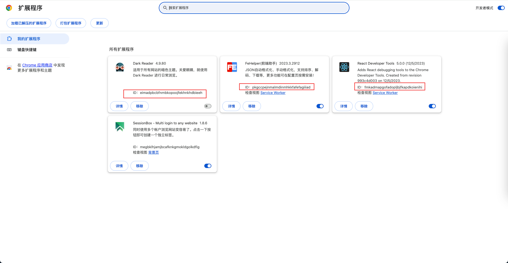

# **Chrome 下载扩展程序CRX格式**

## 1. 查看扩展程序ID



## 2. 替换链接ID然后访问下载

```bash
https://clients2.google.com/service/update2/crx?response=redirect&os=win&arch=x64&os_arch=x86_64&nacl_arch=x86-64&prod=chromecrx&prodchannel=&prodversion=77.0.3865.90&lang=zh-CN&acceptformat=crx2,crx3&x=id%3Dmegbklhjamjbcafknkgmokldgolkdfig%26installsource%3Dondemand%26uc 

# 替换上述megbklhjamjbcafknkgmokldgolkdfig为需要下载的ID

https://clients2.google.com/service/update2/crx?response=redirect&os=win&arch=x64&os_arch=x86_64&nacl_arch=x86-64&prod=chromecrx&prodchannel=&prodversion=77.0.3865.90&lang=zh-CN&acceptformat=crx2,crx3&x=id%3D{ExtensionId}%26installsource%3Dondemand%26uc 

## 替换{ExtensionId}

```

