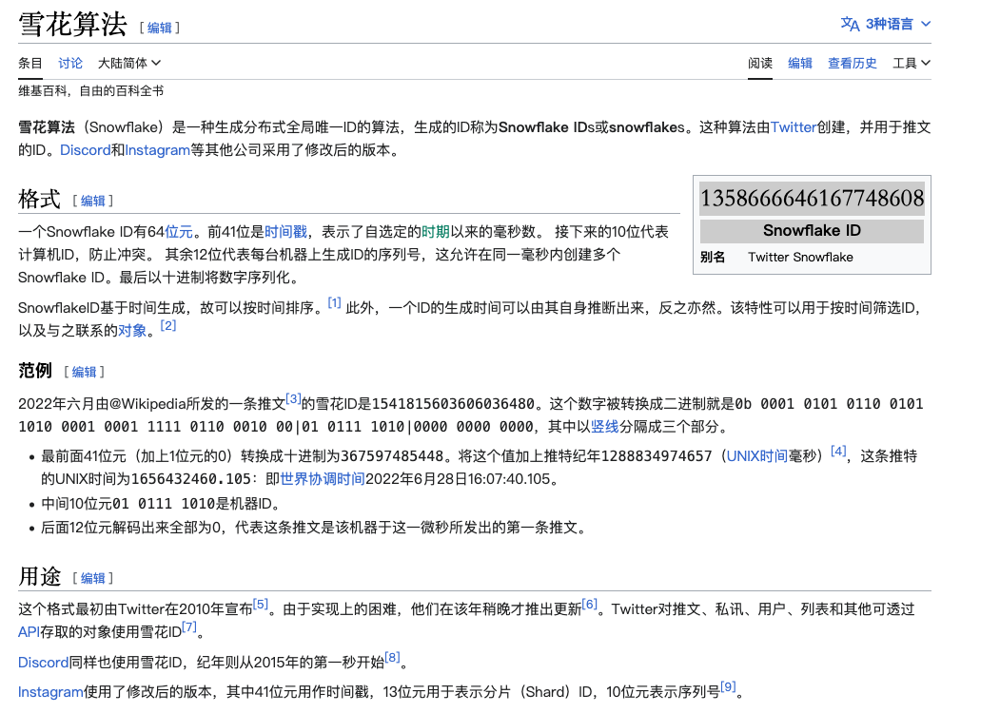

# #分布式ID生成-雪花算法

​​

# 算法描述

* 第1位占用1bit，其值始终是0，可看做是符号位不使用。
* 第2位开始的41位是时间戳，41-bit位可表示2^41个数，每个数代表毫秒， 那么雪花算法可用的时间年限是(1L<<41)/(1000*3600*24*365)=69年的时间。
* 中间的10-bit位可表示机器数 分 5-bit 给 IDC，分5-bit给工作机器。这样就可以表示32个IDC，每个IDC下可以有32台机器
* 最后12-bit位是自增序列，可表示2^12 = 4096个数。

# 算法缺陷

* 只能用69年（其实这个完全可以忽略）
* 服务器时钟回拨（因为算法和时间戳强相关，如果回拨则会出现重复id生成）

```java
@SuppressWarnings({"FieldCanBeLocal", "FieldMayBeFinal"})
public class Snowflake {
    // 开始时间 (2023-05-29)
    private final long startTime = 1685289600000L;
    // 数据中心位数
    private final long datacenterBits = 5L;
    // 机器位数
    private final long machineBits = 5L;
    // 支持的最大机器id，结果是31 (这个移位算法可以很快的计算出几位二进制数所能表示的最大十进制数)
    private final long maxMachineId = ~(-1L << machineBits);
    // 支持的最大数据标识id，结果是31
    private final long maxDatacenterId = ~(-1L << datacenterBits);
    // 最后12位
    private final long sequenceBits = 12L;
    // 生成序列的掩码，这里为4095 (0b111111111111=0xfff=4095)
    private final long sequenceMask = ~(-1L << sequenceBits);
    /**
     * 机器ID向左移12位
     */
    private final long machineIdShift = sequenceBits;
    /**
     * 数据标识id向左移17位(12+5)
     */
    private final long datacenterIdShift = machineIdShift + machineBits;
    /**
     * 时间截向左移22位(5+5+12)
     */
    private final long timestampLeftShift = datacenterIdShift + datacenterBits;
    // 工作机器ID(0~31)
    private long machineId;
    // 数据中心ID(0~31)
    private long datacenterId;
    // 毫秒内序列(0~4095)
    private long sequence = 0L;
    // 上次生成ID的时间截
    private long lastTimestamp = -1L;

    public Snowflake(long datacenterId, long machineId) {
        if (machineId > maxMachineId || machineId < 0) {
            throw new IllegalArgumentException(String.format("machine Id can't be greater than %d or less than 0", maxMachineId));
        }
        if (datacenterId > maxDatacenterId || datacenterId < 0) {
            throw new IllegalArgumentException(String.format("datacenter Id can't be greater than %d or less than 0", maxDatacenterId));
        }
        this.machineId = machineId;
        this.datacenterId = datacenterId;
    }

    public synchronized long nextId() {
        long timestamp = timeGen();
        // 如果当前时间小于上一次ID生成的时间戳，说明系统时钟回退过这个时候应当抛出异常
        if (timestamp < lastTimestamp) {
            throw new RuntimeException(String.format("Clock moved backwards.  Refusing to generate id for %d milliseconds", lastTimestamp - timestamp));
        }
        // 如果是同一时间生成的，则进行毫秒内序列
        if (lastTimestamp == timestamp) {
            sequence = (sequence + 1) & sequenceMask;
            // 毫秒内序列溢出, 确保始终在[0,4095]内
            if (sequence == 0) {
                // 阻塞到下一个毫秒,获得新的时间戳
                timestamp = tilNextMillis(lastTimestamp);
            }
        } else {
            //时间戳改变，毫秒内序列重置
            sequence = 0L;
        }
        //上次生成ID的时间截
        lastTimestamp = timestamp;
        // 移位并通过或运算拼到一起组成64位的ID
        return (timestamp - startTime) << timestampLeftShift
                | (datacenterId << datacenterIdShift)
                | (machineId << machineIdShift)
                | sequence;
    }

    private long tilNextMillis(long lastTimestamp) {
        long timestamp = timeGen();
        while (timestamp <= lastTimestamp) {
            timestamp = timeGen();
        }
        return timestamp;
    }

    private long timeGen() {
        return System.currentTimeMillis();
    }

	// main入口函数
    public static void main(String[] args) {
		// datacenterId: 数据中心ID 一般启动时候设置
		// machineId: 服务节点ID 一般启动时候设置
        Snowflake snowflake = new Snowflake(0, 0);
        for (int j = 0; j < 100; j++) {
            System.out.println(snowflake.nextId());
        }
    }
}
```
