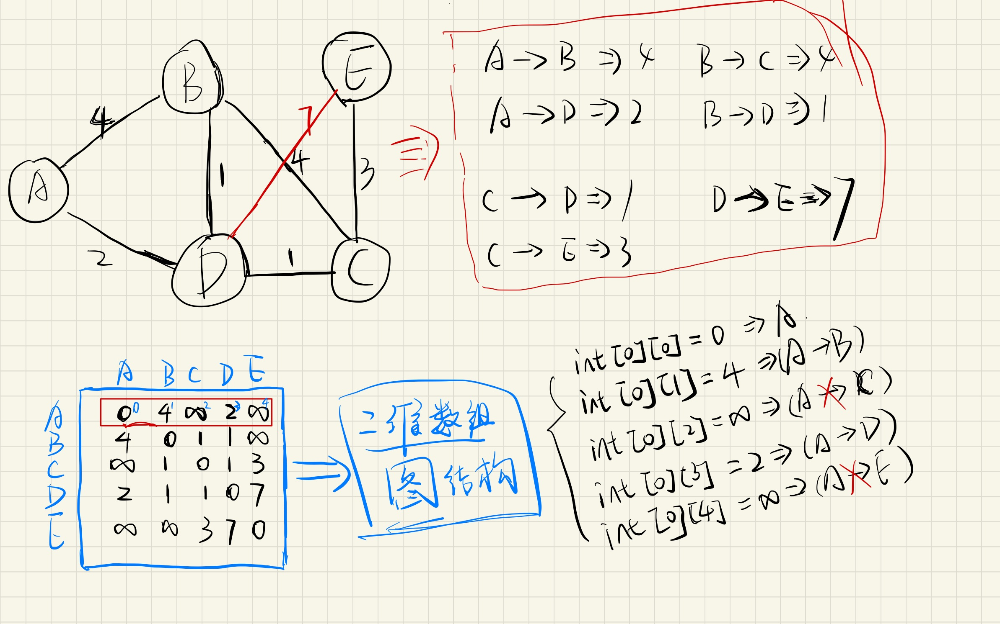
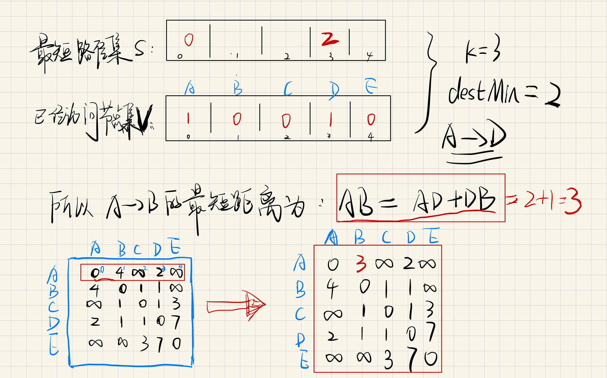

# #最短路径-Dijkstra算法

# 介绍 - (图)最短路径算法

> 迪杰斯特拉(Dijkstra)算法是典型最短路径算法，用于计算一个节点到其他节点的最短路径

# 限制条件

图G中不存在负权值的边（这个可以通过弗洛伊德算法，后期将进行讲解）

# 画图理解

‍

​​

 ​

第一步: 先访问A点到其他可到达点的最短距离记为：disMin，此时该点为中转节点

第二步: 判断A到B的距离是否大于中转节点距离之和(此时D是中转节点) AB > AD + DB

第三步: 更新A点到B点的最短距离为(AD+DB)

# 实现

```java
public class DijkstraUtil {
    public static void main(String[] args) {
        final int M = 10000; // 代表正无穷
        // 二维数组每一行分别是 A、B、C、D、E 各点到其余点的距离,
        // A -> A 距离为0, 常量M 为正无穷
        int[][] graph = {
                {0, 4, M, 2, M},
                {4, 0, 4, 1, M},
                {M, 4, 0, 1, 3},
                {2, 1, 1, 0, 7},
                {M, M, 3, 7, 0}
        };
        int start = 0;
        int[] shortPath = shortestPath(graph, start);
        for (int i = 0; i < shortPath.length; i++) {
            System.out.println("从" + start + "出发到" + i + "的最短距离为：" + shortPath[i]);
        }
    }

    public static int[] shortestPath(int[][] graph, int start) {
        // 数组构建
        final int length = graph.length;
        int[] shortestPathArray = new int[length];
        int[] visitedArray = new int[length];
        // 初始化
        // start==>start 路径长度为0
        shortestPathArray[start] = 0;
        // start 节点默认放在集合中
        visitedArray[start] = 1;
        // 开始循环处理剩下的节点
        for(int i = 1; i < length; i++) {
            // 距离 start 最近的点
            int k = -1;
            // 距离 start 最近的距离
            int disMin = Integer.MAX_VALUE;
            //1. 选取出距离顶点 start 最近的一个顶点
            for(int j = 1; j < length; j++) {
                // 元素不在已访问的列表中且
                if(visitedArray[j] == 0 && graph[start][j] < disMin) {
                    disMin = graph[start][j];
                    k = j;
                }
            }
            // 更新信息,加入到最短的集合
            visitedArray[k] = 1;
            shortestPathArray[k] = disMin;
            // 更新距离表
            for(int index = 1; index < length; index++) {
                //1. 不在最短列表中
                //2. start==>shortestIndex+si==>index < start==>index，则进行距离表更新
                if(visitedArray[index] == 0
                        && graph[start][k]+graph[k][index] < graph[start][index]) {
                    graph[start][index] = graph[start][k]+graph[k][index];
                }
            }
        }
        return shortestPathArray;
    }
}
```

运行结果如下：

```
从0出发到0的最短距离为：0
从0出发到1的最短距离为：3
从0出发到2的最短距离为：3
从0出发到3的最短距离为：2
从0出发到4的最短距离为：6
```

# 拓展

> 最短路径问题是图论研究中的一个经典算法问题，旨在寻找图（由结点和路径组成的）中两结点之间的最短路径。算法具体的形式包括：

**确定起点的最短路径问题** - 也叫单源最短路问题，即已知起始结点，求最短路径的问题。在边权非负时适合使用Dijkstra算法，若边权为负时则适合使用Bellman-ford算法或者SPFA算法。 **确定终点的最短路径问题** - 与确定起点的问题相反，该问题是已知终结结点，求最短路径的问题。在无向图中该问题与确定起点的问题完全等同，在有向图中该问题等同于把所有路径方向反转的确定起点的问题。 **确定起点终点的最短路径问题** - 即已知起点和终点，求两结点之间的最短路径。 **全局最短路径问题** - 也叫多源最短路问题，求图中所有的最短路径。适合使用Floyd-Warshall算法。 用于解决最短路径问题的算法被称做“最短路径算法”，有时被简称作“路径算法”。最常用的路径算法有：

```plaintext
Dijkstra算法
A*算法
Bellman-Ford算法
SPFA算法（Bellman-Ford算法的改进版本）
Floyd-Warshall算法
Johnson算法
Bi-Direction BFS算法
```
