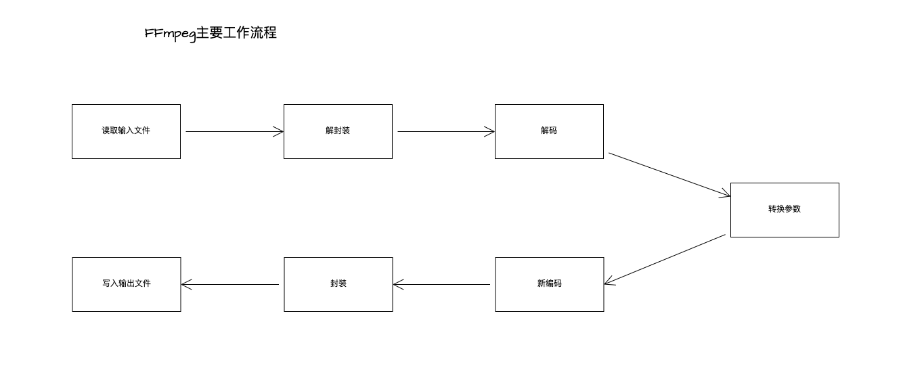

# ffmpeg主要工作流程

读取文件 -> 解封装 -> 解码 -> 重新编码 -> 重新封装 -> 输出文件




# ffmpeg命令


ffmpeg命令主要分为六大部分

* ffmpeg信息查询部分
* 公共参数操作部分
* 文件主要操作参数部分
* 视频操作参数部分
* 音频操作参数部分
* 字幕操作参数部分

```bash

➜  ~ ffmpeg -help
ffmpeg version N-112441-gc06d3d2404-tessus  https://evermeet.cx/ffmpeg/  Copyright (c) 2000-2023 the FFmpeg developers
  built with Apple clang version 11.0.0 (clang-1100.0.33.17)
  configuration: --cc=/usr/bin/clang --prefix=/opt/ffmpeg --extra-version=tessus --enable-avisynth --enable-fontconfig --enable-gpl --enable-libaom --enable-libass --enable-libbluray --enable-libdav1d --enable-libfreetype --enable-libgsm --enable-libmodplug --enable-libmp3lame --enable-libmysofa --enable-libopencore-amrnb --enable-libopencore-amrwb --enable-libopenh264 --enable-libopenjpeg --enable-libopus --enable-librubberband --enable-libshine --enable-libsnappy --enable-libsoxr --enable-libspeex --enable-libtheora --enable-libtwolame --enable-libvidstab --enable-libvmaf --enable-libvo-amrwbenc --enable-libvorbis --enable-libvpx --enable-libwebp --enable-libx264 --enable-libx265 --enable-libxavs --enable-libxml2 --enable-libxvid --enable-libzimg --enable-libzmq --enable-libzvbi --enable-version3 --pkg-config-flags=--static --disable-ffplay
  libavutil      58. 27.100 / 58. 27.100
  libavcodec     60. 30.102 / 60. 30.102
  libavformat    60. 15.100 / 60. 15.100
  libavdevice    60.  2.101 / 60.  2.101
  libavfilter     9. 11.100 /  9. 11.100
  libswscale      7.  4.100 /  7.  4.100
  libswresample   4. 11.100 /  4. 11.100
  libpostproc    57.  2.100 / 57.  2.100
Hyper fast Audio and Video encoder
usage: ffmpeg [options] [[infile options] -i infile]... {[outfile options] outfile}...

Getting help:
    -h      -- print basic options
    -h long -- print more options
    -h full -- print all options (including all format and codec specific options, very long)
    -h type=name -- print all options for the named decoder/encoder/demuxer/muxer/filter/bsf/protocol
    See man ffmpeg for detailed description of the options.

Print help / information / capabilities:
-L                  show license
-h topic            show help
-? topic            show help
-help topic         show help
--help topic        show help
-version            show version
-buildconf          show build configuration
-formats            show available formats
-muxers             show available muxers
-demuxers           show available demuxers
-devices            show available devices
-codecs             show available codecs
-decoders           show available decoders
-encoders           show available encoders
-bsfs               show available bit stream filters
-protocols          show available protocols
-filters            show available filters
-pix_fmts           show available pixel formats
-layouts            show standard channel layouts
-sample_fmts        show available audio sample formats
-dispositions       show available stream dispositions
-colors             show available color names
-sources device     list sources of the input device
-sinks device       list sinks of the output device
-hwaccels           show available HW acceleration methods

Global options (affect whole program instead of just one file):
-loglevel loglevel  set logging level
-v loglevel         set logging level
-report             generate a report
-max_alloc bytes    set maximum size of a single allocated block
-y                  overwrite output files
-n                  never overwrite output files
-ignore_unknown     Ignore unknown stream types
-filter_threads     number of non-complex filter threads
-filter_complex_threads  number of threads for -filter_complex
-stats              print progress report during encoding
-max_error_rate maximum error rate  ratio of decoding errors (0.0: no errors, 1.0: 100% errors) above which ffmpeg returns an error instead of success.

Per-file main options:
-f fmt              force format
-c codec            codec name
-codec codec        codec name
-pre preset         preset name
-map_metadata outfile[,metadata]:infile[,metadata]  set metadata information of outfile from infile
-t duration         record or transcode "duration" seconds of audio/video
-to time_stop       record or transcode stop time
-fs limit_size      set the limit file size in bytes
-ss time_off        set the start time offset
-sseof time_off     set the start time offset relative to EOF
-seek_timestamp     enable/disable seeking by timestamp with -ss
-timestamp time     set the recording timestamp ('now' to set the current time)
-metadata string=string  add metadata
-program title=string:st=number...  add program with specified streams
-target type        specify target file type ("vcd", "svcd", "dvd", "dv" or "dv50" with optional prefixes "pal-", "ntsc-" or "film-")
-apad               audio pad
-frames number      set the number of frames to output
-filter filter_graph  set stream filtergraph
-filter_script filename  read stream filtergraph description from a file
-reinit_filter      reinit filtergraph on input parameter changes
-discard            discard
-disposition        disposition

Video options:
-vframes number     set the number of video frames to output
-r rate             set frame rate (Hz value, fraction or abbreviation)
-fpsmax rate        set max frame rate (Hz value, fraction or abbreviation)
-s size             set frame size (WxH or abbreviation)
-aspect aspect      set aspect ratio (4:3, 16:9 or 1.3333, 1.7777)
-display_rotation angle  set pure counter-clockwise rotation in degrees for stream(s)
-display_hflip      set display horizontal flip for stream(s) (overrides any display rotation if it is not set)
-display_vflip      set display vertical flip for stream(s) (overrides any display rotation if it is not set)
-vn                 disable video
-vcodec codec       force video codec ('copy' to copy stream)
-timecode hh:mm:ss[:;.]ff  set initial TimeCode value.
-pass n             select the pass number (1 to 3)
-vf filter_graph    set video filters
-b bitrate          video bitrate (please use -b:v)
-dn                 disable data

Audio options:
-aframes number     set the number of audio frames to output
-aq quality         set audio quality (codec-specific)
-ar rate            set audio sampling rate (in Hz)
-ac channels        set number of audio channels
-an                 disable audio
-acodec codec       force audio codec ('copy' to copy stream)
-ab bitrate         audio bitrate (please use -b:a)
-af filter_graph    set audio filters

Subtitle options:
-s size             set frame size (WxH or abbreviation)
-sn                 disable subtitle
-scodec codec       force subtitle codec ('copy' to copy stream)
-stag fourcc/tag    force subtitle tag/fourcc
-fix_sub_duration   fix subtitles duration
-canvas_size size   set canvas size (WxH or abbreviation)
-spre preset        set the subtitle options to the indicated preset

```